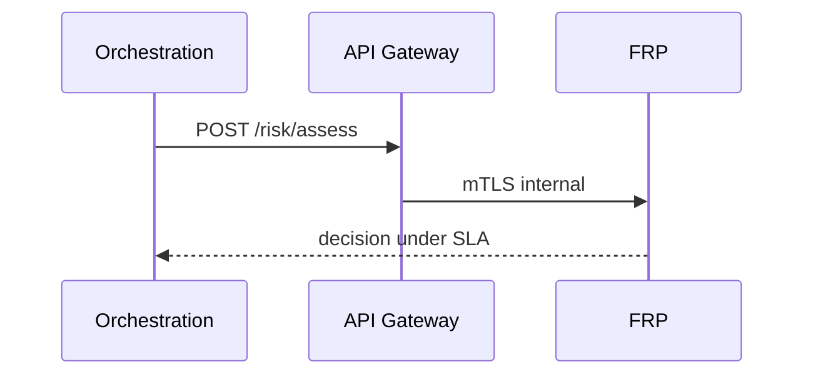

# 07 — API Specification

**Base:** `/api/v1/risk`

---

## Executive summary

Sync **risk assessment** for orchestration, score retrieval, alerts, cases, lists, rules, and reports.

---

## Business purpose

Stable contracts between orchestration (latency-critical) and fraud operations (control plane).

---

## Risk assessment (sync)

| Method | Path | Description |
| --- | --- | --- |
| POST | `/risk/assess` | Pre-auth assessment |
| GET | `/risk/assessments/{id}` | Assessment detail |
| POST | `/risk/assessments/{id}/reassess` | Post new evidence (async job) |

**POST `/risk/assess` (request sketch)**

```json
{
  "payment_intent_id": "uuid",
  "merchant_id": "uuid",
  "customer_ref": "string",
  "amount": { "value": "10000", "currency": "TZS" },
  "channel": "softpos",
  "payment_method_type": "mobile_money",
  "device_id": "uuid",
  "geo": { "lat": -6.79, "lon": 39.28 },
  "metadata": {}
}
```

**Response**

```json
{
  "assessment_id": "uuid",
  "decision": "approve",
  "score": 210,
  "reason_codes": ["MERCHANT_TRUSTED"],
  "expires_at": "2026-08-06T12:00:00Z"
}
```

---

## Risk score

| Method | Path |
| --- | --- |
| GET | `/risk/scores/{assessment_id}` |
| GET | `/risk/profiles/merchant/{merchant_id}` |
| GET | `/risk/profiles/customer/{customer_ref}` |
| GET | `/risk/profiles/device/{device_id}` |

---

## Fraud alerts

| Method | Path |
| --- | --- |
| GET | `/alerts` |
| GET | `/alerts/{id}` |
| POST | `/alerts/{id}/acknowledge` |

---

## Case management

| Method | Path |
| --- | --- |
| POST | `/cases` |
| GET | `/cases` |
| GET | `/cases/{id}` |
| POST | `/cases/{id}/assign` |
| POST | `/cases/{id}/notes` |
| POST | `/cases/{id}/evidence` |
| POST | `/cases/{id}/resolve` |
| POST | `/cases/{id}/escalate` |

---

## Watchlists / blacklists / whitelists

| Method | Path |
| --- | --- |
| GET/POST | `/lists/watchlist` |
| POST | `/lists/watchlist/{id}/entries` |
| GET/POST | `/lists/blacklist` |
| GET/POST | `/lists/whitelist` |
| POST | `/lists/*/entries/{id}/approve` | Maker-checker |

---

## Rule management

| Method | Path |
| --- | --- |
| GET/POST | `/rules` |
| GET | `/rules/{id}/versions` |
| POST | `/rules/{id}/publish` |
| POST | `/rules/dry-run` |
| POST | `/rules/{id}/shadow` |

---

## Risk reports

| Method | Path |
| --- | --- |
| GET | `/reports/fraud/daily` |
| GET | `/reports/merchant/{merchant_id}/risk` |
| GET | `/reports/rules/performance` |
| POST | `/reports/compliance/export` |

---

## Sequence: orchestration calls assess



---

## Domain events

Published on assess complete, fraud detected, case lifecycle — [08_EVENT_CATALOG.md](08_EVENT_CATALOG.md).

---

## AWS

API Gateway + WAF; ECS Fargate; IAM scoped service roles.

---

## Security

Service-to-service JWT; no public assess without merchant context; rate limits.

---

## Implementation strategy

OpenAPI `tnpi-fraud-risk-v1`; idempotency-Key on assess.

---

## Future expansion

GraphQL read API for ops console only.

---

## Cross-references

[02_RISK_ENGINE.md](02_RISK_ENGINE.md) · [10_SECURITY_MODEL.md](10_SECURITY_MODEL.md)
