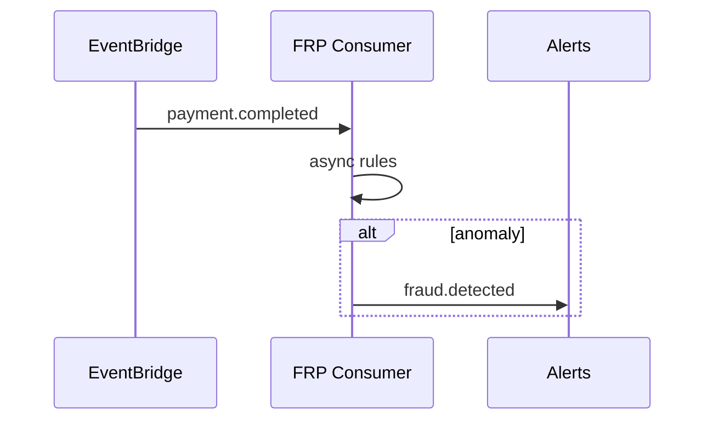

# 08 — Event Catalog

**Topic prefix:** `tnpi.risk` · **EventBridge bus:** `tnpi-platform`

---

## Executive summary

Enterprise events for assessments, fraud outcomes, entity flags, cases, and list updates—consumed by orchestration, ops, data lake, and (read-only) recon analytics.

---

## Business purpose

Loose coupling; audit replay; downstream alerting without polling.

---

## Assessment lifecycle

| Event | When | Key payload |
| --- | --- | --- |
| `risk.assessment.started` | Assess accepted | `assessment_id`, `payment_intent_id` |
| `risk.assessment.completed` | Decision finalized | `decision`, `score`, `reason_codes[]` |
| `risk.assessment.failed` | Pipeline error | `error_code`, `retryable` |
| `risk.score.generated` | Score persisted | `score`, `components` |

---

## Fraud outcomes

| Event | When |
| --- | --- |
| `fraud.detected` | Rule/ML confirms fraud pattern |
| `fraud.prevented` | Decline on high-risk |
| `merchant.flagged` | Merchant risk threshold |
| `customer.flagged` | Customer abuse signal |
| `device.flagged` | Device compromise signal |

---

## Cases & lists

| Event | When |
| --- | --- |
| `case.created` | New investigation |
| `case.assigned` | Owner set |
| `case.escalated` | Priority bump |
| `case.closed` | Disposition recorded |
| `watchlist.updated` | Entry add/remove |
| `blacklist.updated` | Entry change (approved) |
| `whitelist.updated` | Trusted entry change |

---

## Rules

| Event | When |
| --- | --- |
| `fraud.rule.published` | New rule version live |
| `fraud.rule.shadow.result` | Shadow evaluation metrics |

---

## Sequence: post-auth monitor

---

## Subscriptions (indicative)

| Consumer | Events |
| --- | --- |
| Orchestration | `risk.assessment.completed` (echo) |
| SNS ops | `fraud.detected`, `case.created` |
| Data lake | All `risk.*`, `fraud.*` |
| Reconciliation | None (FRP consumes recon, not vice versa) |

---

## Schema governance

CloudEvents 1.0 envelope; JSON Schema in schema registry; version field mandatory.

---

## Security

Sensitive fields hashed in bus payload where possible; full detail in RDS only.

---

## AWS

EventBridge rules → SQS → Fargate/Lambda workers.

---

## Implementation strategy

Register schemas in FR-0; contract tests with orchestration.

---

## Future expansion

National fraud intelligence hub (regulated publish/subscribe).

---

## Cross-references

[02_RISK_ENGINE.md](02_RISK_ENGINE.md) · [07_API_SPECIFICATION.md](07_API_SPECIFICATION.md)
