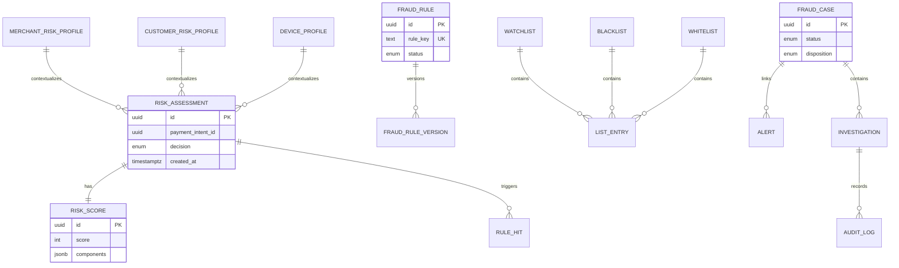

# 09 — Database Model

**Schema:** `fraud_risk`

---

## Executive summary

ER for assessments, scores, rules, profiles, lists, cases, alerts, investigations, audit.

---

## Business purpose

Durable SoR for risk decisions and investigations—not payment or ledger SoR.

---

## ER diagram

---

## Entity summary

| Entity | Role |
| --- | --- |
| `RiskAssessment` | One assess request/response |
| `RiskScore` | Score breakdown |
| `FraudRule` / version | Rule definitions |
| `MerchantRiskProfile` | Rolling trust metrics |
| `CustomerRiskProfile` | Velocity, labels |
| `DeviceProfile` | Enrollment, reputation |
| `Watchlist` / `Blacklist` / `Whitelist` | List containers |
| `ListEntry` | Typed entry + expiry |
| `Alert` | Operational alert |
| `FraudCase` | Investigation container |
| `Investigation` | Activity thread |
| `AuditLog` | Immutable append |

---

## Cross-context references

Store `payment_id`, `merchant_id` as UUIDs **without FK** to orchestration DB.

---

## Redis (ephemeral)

Velocity counters, session device cache, assess idempotency keys (TTL).

---

## API / events

Written on `risk.assessment.completed`; cases on `case.*`.

---

## Security

Column-level encryption for national ID hashes; KMS for S3 evidence.

---

## AWS

RDS PostgreSQL Multi-AZ; read replica for reporting; Redis ElastiCache.

---

## Implementation strategy

Partition `risk_assessment` by month; archive &gt; 24 months to S3 parquet.

---

## Future expansion

Feature store tables for ML.

---

## Cross-references

[04_RISK_SCORING.md](04_RISK_SCORING.md) · [05_CASE_MANAGEMENT.md](05_CASE_MANAGEMENT.md)
