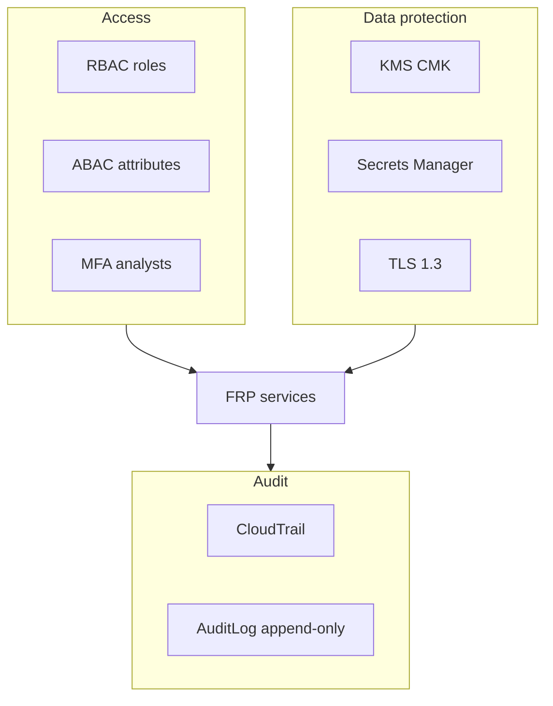

# 10 — Security Model

---

## Executive summary

FRP security: RBAC + ABAC, maker-checker on lists/rules prod changes, immutable audit, encryption (KMS), Secrets Manager, PCI DSS alignment (no PAN), AML-ready logging and retention.

---

## Business purpose

Fraud systems are insider-threat and regulatory hotspots; controls are mandatory from day one.

---

## Architecture overview

---

## Roles (indicative)

| Role | Capabilities |
| --- | --- |
| `risk_analyst` | Cases, alerts, read rules |
| `risk_admin` | Rule draft, list draft |
| `risk_approver` | Publish rules/lists |
| `risk_viewer` | Dashboards only |
| `frp_service` | Assess API only |

ABAC: merchant_id scope for partner fraud teams (future).

---

## Maker-checker

Blacklist additions, rule publish prod, compliance exports.

---

## PCI DSS

- No storage of PAN/CVV; only tokens and last4 from orchestration.  
- Assess payloads minimized; log redaction.  
- Segmented VPC; no direct internet to RDS.

---

## AML readiness

Transaction monitoring alerts → case → SAR workflow placeholder (process owner: compliance); retain 7y per policy.

---

## Immutable logs

`audit_log` append-only; CloudTrail on admin APIs; S3 Object Lock for compliance bundles.

---

## Data retention

| Data | Retention |
| --- | --- |
| Assessments | 7 years |
| Cases | 7 years |
| Redis velocity | 24–72h |
| ML features | per model card |

---

## AWS security services

GuardDuty, Security Hub, IAM boundary policies, WAF on API Gateway.

---

## Operational considerations

Quarterly access review; break-glass documented.

---

## Implementation strategy

FR-0: IAM baselines + audit table; FR-3: maker-checker workflows.

---

## Future expansion

HSM for signing list bundles; national intel feed verification keys.

---

## Cross-references

[07_API_SPECIFICATION.md](07_API_SPECIFICATION.md) · [11_AWS_ARCHITECTURE.md](11_AWS_ARCHITECTURE.md)
