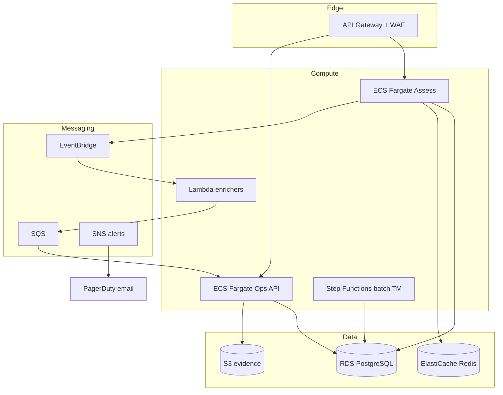
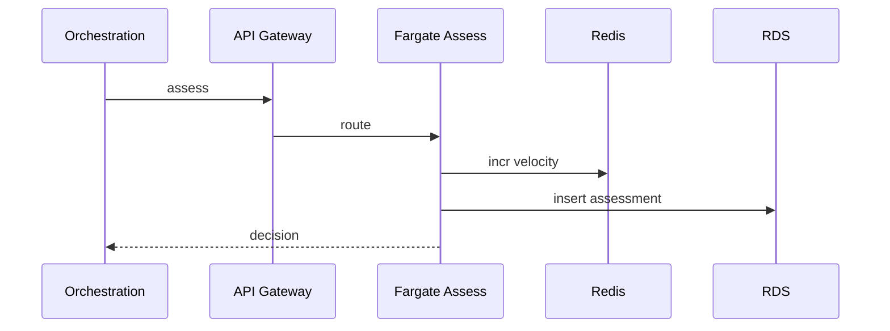

# 11 — AWS Architecture

---

## Executive summary

Production AWS layout for FRP: API Gateway, ECS Fargate (assess + admin), Lambda (enrichers), Step Functions (batch TM), RDS PostgreSQL, Redis, SQS/SNS, EventBridge, CloudWatch, CloudTrail, KMS, Secrets Manager, Backup, GuardDuty, Security Hub.

---

## Business purpose

Horizontally scalable, low-latency assess path with isolated control plane and clear blast radius.

---

## Architecture overview

---

## Sync assess path

API Gateway → VPC Link → Fargate assess service (auto-scaling on CPU + p99 latency); Redis for velocity; RDS write assessment async buffer optional (SQS) if spike.

---

## Async path

`payment.*` rules on EventBridge → SQS → Fargate workers; DLQ + alarm.

---

## Sequence: assess at scale

---

## Multi-account

| Account | Workloads |
| --- | --- |
| TNPI prod | FRP prod |
| TNPI staging | FRP staging |
| Security | CloudTrail aggregation |

---

## DR

RDS cross-region read replica; RTO 4h / RPO 15m targets; runbook in Taifa Core.

---

## Secrets

PSP intel API keys, internal JWT signing — Secrets Manager rotation.

---

## Observability

CloudWatch metrics, X-Ray on assess path, log insights — [12_OBSERVABILITY.md](12_OBSERVABILITY.md).

---

## Security

Private subnets; SG least privilege; KMS CMK per env.

---

## Implementation strategy

Terraform module `tnpi-fraud-risk`; reuse Taifa Core VPC from Sprint 0.

---

## Future expansion

SageMaker in ML account; VPC endpoints for S3/DynamoDB.

---

## Cross-references

[02_RISK_ENGINE.md](02_RISK_ENGINE.md) · [10_SECURITY_MODEL.md](10_SECURITY_MODEL.md)
