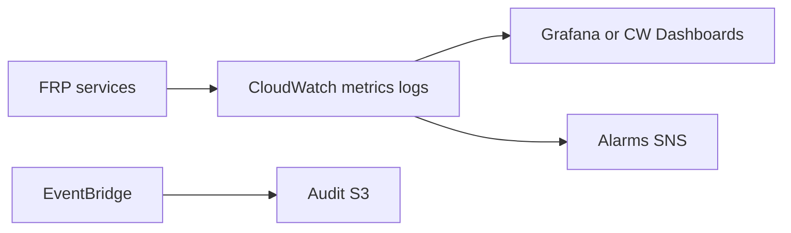

# 12 — Observability

---

## Executive summary

Fraud and risk dashboards, real-time alerts, rule performance, false positive rate, detection rate, assess latency, case SLAs, operational KPIs.

---

## Business purpose

Fraud ops and executives need measurable defense effectiveness without blind spots.

---

## Architecture overview

---

## Key metrics

| Metric | Description |
| --- | --- |
| `frp.assess.latency.p99` | Sync path SLA |
| `frp.assess.count` | Volume by channel |
| `frp.decision.approve_rate` | Approval ratio |
| `frp.decision.decline_rate` | Blocks |
| `frp.decision.review_rate` | Manual queue pressure |
| `frp.fraud.detected` | Confirmed signals |
| `frp.fraud.prevented` | Declines high risk |
| `frp.rules.hit_rate` | Per rule |
| `frp.false_positive_rate` | Cases FP / total declines |
| `frp.cases.open` | Backlog |
| `frp.cases.resolution_time` | SLA |
| `frp.ml.inference.errors` | ML availability |

---

## Dashboards

| Dashboard | Audience |
| --- | --- |
| Executive | Fraud prevented $, trend |
| Fraud ops | Queue, alerts, cases |
| Rules | Hit rate, shadow vs live |
| Merchant risk | Top flagged merchants |
| SRE | Latency, errors, Redis, RDS |

---

## Alerts

| Alert | Threshold |
| --- | --- |
| Assess p99 &gt; 200ms | 5 min |
| Error rate &gt; 1% | 5 min |
| Review queue &gt; 500 | 1 h |
| ML endpoint down | Failover to rules-only |

---

## Risk decision flow (telemetry)

Trace `assessment_id` across orchestration ↔ FRP via correlation ID.

---

## AWS

CloudWatch Logs subscription to security account; CloudTrail data events on S3 evidence.

---

## Security

Dashboards no raw PII; role-based Grafana.

---

## Implementation strategy

FR-1: latency + decision metrics; FR-4: case SLA dashboards.

---

## Future expansion

OpenTelemetry export to Datadog if enterprise standardizes.

---

## Cross-references

[05_CASE_MANAGEMENT.md](05_CASE_MANAGEMENT.md) · [16_ACCEPTANCE_CRITERIA.md](16_ACCEPTANCE_CRITERIA.md)
