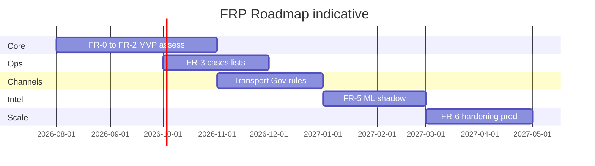

# 14 — Roadmap

---

## Executive summary

12-month roadmap: MVP national assess (Q1–Q2), cases + transport/gov rules (Q2–Q3), ML shadow (Q3–Q4), AML TM maturity (Q4).

---

## Business purpose

Align fraud investment with TNPI channel rollout and regulatory milestones.

---

## Phases

---

## Milestones

| Milestone | Target | Outcome |
| --- | --- | --- |
| M1 | FR-2 complete | Live assess staging |
| M2 | FR-3 complete | Case queue operational |
| M3 | FR-4 complete | Post-auth monitoring |
| M4 | FR-5 complete | ML shadow metrics |
| M5 | FR-7 gate | Phase 8 Developer Platform |

---

## Channel rollout

| Channel | Fraud pack |
| --- | --- |
| API / wallet | Velocity v1 |
| SoftPOS | Device rules |
| QR / links | Merchant URL risk |
| Government | Control number brute force |
| Transport | Micro-ticket velocity |

---

## Dependencies

Orchestration hook · Merchant KYC tier · MAP device enrollment.

---

## Future expansion

Cross-border · digital identity · open banking risk.

---

## Cross-references

[15_BACKLOG.md](15_BACKLOG.md) · [PHASE7_GATE_PACKAGE.md](PHASE7_GATE_PACKAGE.md)
