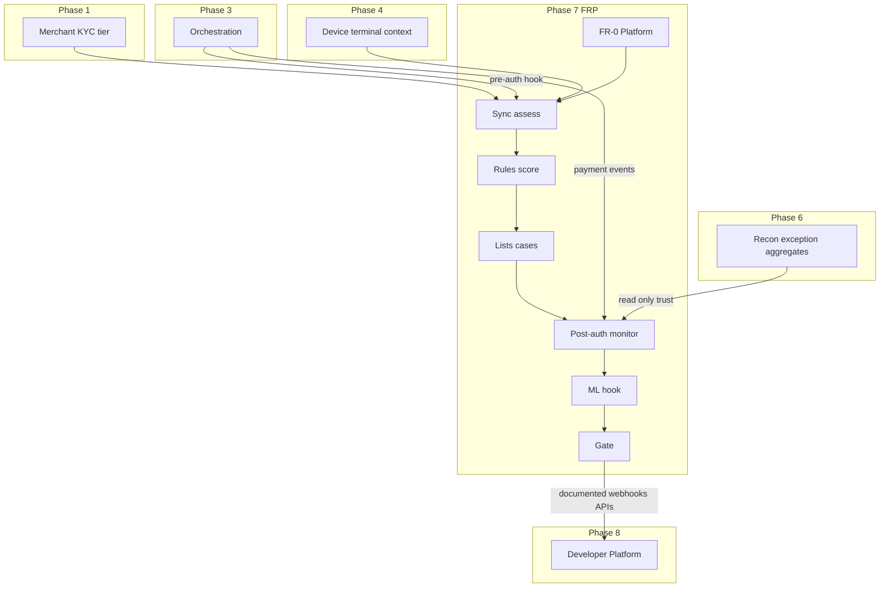

# TNPI Phase 7 — Gate Package (Fraud & Risk Platform)

**Status:** Architecture planning complete — Phase 6 Reconciliation gate assumed **approved**  
**Date:** 2026-08-06

---

## 1. Product Readiness Report

### Executive summary

The **Fraud & Risk Platform (FRP)** pack (`docs/payments/fraud-risk/00–18`) defines TNPI Phase 7: centralized **pre-auth assessment** and **post-auth monitoring**, rules, scoring, lists, cases, ML hooks, and AML-ready controls—consuming orchestration and reconciliation signals. **No payment processing, settlement, or reconciliation implementation.**

### Readiness matrix

| Dimension | Status |
| --- | --- |
| Vision, risk engine, rules, scoring, cases | ✅ |
| ML integration design (modular) | ✅ |
| APIs, events, ER, security, AWS, observability | ✅ |
| Implementation guide, backlog, acceptance, risks | ✅ |
| **Implementation** | ⬜ |
| **Orchestration pre-auth hook (staging)** | ⬜ |
| **Recon exception feed (staging)** | ⬜ assumed from Phase 6 design |

### Verdict

| Question | Answer |
| --- | --- |
| Start FRP **implementation**? | **Yes** (architecture) |
| National production fraud layer? | **After** §5 + acceptance |
| Start Phase 8 Developer Platform? | After §6 exit |

---

## 2. Dependency Graph

**Boundary:** FRP **never** authorizes at PSP; orchestration remains payment brain. FRP **never** writes recon or settlement ledgers.

---

## 3. Sprint Breakdown

| Sprint | Duration | Focus | Backlog |
| --- | --- | --- | --- |
| **FR-0** | 2 wk | IaC, schemas, IAM audit | FRB-001–002 |
| **FR-1** | 3 wk | Assess API + orchestration hook | FRB-003–005 |
| **FR-2** | 4 wk | Rules + formula scoring | FRB-006–008 |
| **FR-3** | 4 wk | Lists + cases + alerts | FRB-009–011 |
| **FR-4** | 3 wk | Post-auth + recon ingest + profiles | FRB-012–014 |
| **FR-5** | 3 wk | ML stub + dashboards | FRB-015–016 |
| **FR-6** | 2 wk | Load, compliance export, hardening | FRB-017–018 |
| **FR-7** | 2 wk | Gate + Developer Platform charter | FRB-019 |

**Total (indicative):** ~23 weeks

---

## 4. Architecture Review Report

### Scope

FRP as intelligence layer; sync latency; fail-open vs fail-closed; PCI/AML; separation from recon SoR.

### Findings

| ID | Finding | Severity | Action |
| --- | --- | --- | --- |
| AR-FR-01 | Mandatory pre-auth hook — no bypass path | Critical | API gateway policy + orchestration guard |
| AR-FR-02 | Fail-closed prod vs sandbox fail-open | High | ADR-TNPI-FR-001 |
| AR-FR-03 | Rules-only when ML down | High | ADR-TNPI-FR-002 |
| AR-FR-04 | List changes need maker-checker | High | FR-3 |
| AR-FR-05 | Recon feeds trust only, not auto-decline v1 | Med | Document in FR-4 |
| AR-FR-06 | PII in assess payloads | High | Redaction + retention policy |
| AR-FR-07 | Review hold blocks funds flow — SLA | Med | Case SLAs + escalation |

### Proposed ADRs

- **ADR-TNPI-FR-001** — Production payment assess fail-closed if FRP unavailable  
- **ADR-TNPI-FR-002** — ML advisory; deterministic fallback always available  
- **ADR-TNPI-FR-003** — FRP read-only on payment/settlement/recon SoR

### Verdict

**Approved to implement Phase 7** when orchestration assess contract is frozen (ORB fraud hook from Phase 3).

---

## 5. Production Readiness Assessment

| Area | Staging | Production |
| --- | --- | --- |
| Assess p99 | &lt; 200 ms | &lt; 150 ms monitored |
| Hook coverage | 100% sandbox payments | 100% prod |
| False positive review | Manual tuning | &lt; 5% target declines overturned |
| Fraud ops staffing | Business hours | 24/5 P1 |
| ML | Shadow only | Canary merchants optional |
| Audit | Sample export | 7y retention |
| DR | Single region | Multi-AZ + replica test |

**Verdict:** Architecture **ready**; production FRP **after** FR-1–FR-4 staging sign-off + fraud ops runbooks.

---

## 6. Exit Criteria — Phase 8 (Developer Platform)

Phase 8 may start when:

| # | Criterion |
| --- | --- |
| E1 | [16_ACCEPTANCE_CRITERIA.md](16_ACCEPTANCE_CRITERIA.md) AC-F1–F12 + AC-N1–N4 staging passed |
| E2 | Phase 7 gate signed |
| E3 | 100% sandbox payments pass through assess hook for 30 consecutive days |
| E4 | Rule publish maker-checker demonstrated |
| E5 | Case workflow E2E with audit trail |
| E6 | Post-auth monitor live for `payment.completed` |
| E7 | Fraud dashboards operational (latency, decisions, cases) |
| E8 | **Developer Platform design pack** initiated (`docs/payments/developer-platform/` or platform dev portal charter) |
| E9 | Public API surface inventory from Phases 1–7 consolidated for portal |
| E10 | Webhook + API key patterns documented for partner onboarding (no full portal required) |
| E11 | Boundary audit: no payment capture, settlement, or recon matching in FRP repo |
| E12 | Security sign-off on list/rule admin APIs |

**Phase 8 scope (preview):** National **Developer Platform**—partner portal, API keys, OAuth apps, sandbox tenants, SDKs, webhook replay, certification program—exposing TNPI capabilities without duplicating orchestration or FRP internals.

---

## Cross-references

[00_INDEX.md](00_INDEX.md) · [reconciliation/PHASE6_GATE_PACKAGE.md](../reconciliation/PHASE6_GATE_PACKAGE.md)
