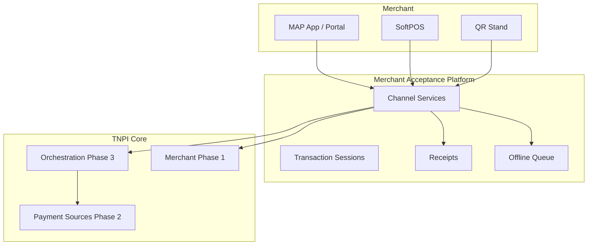
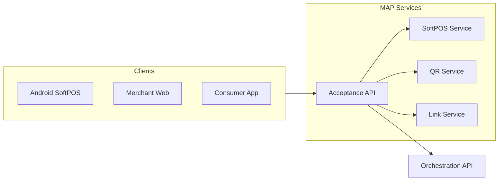

# 01 — Product Vision (MAP)

---

## Executive summary

The **Merchant Acceptance Platform (MAP)** is TNPI Phase 4: national infrastructure for **accepting** digital payments—SoftPOS, QR, links, in-app checkout—unified under one merchant experience, powered exclusively by **Payment Orchestration**.

---

## Business purpose

Merchants need one app and one integration surface; customers need tap, scan, or open a link—MAP delivers both without duplicating payment logic.

---

## Business architecture

---

## Capability model

| Domain | Capabilities |
| --- | --- |
| SoftPOS | Tap card/wallet, refunds, offline sync |
| QR | Static, dynamic, merchant/customer, transport/gov profiles |
| Links | SMS, WhatsApp, email, invoice, recurring |
| Checkout | In-app, e-com API, customer display |
| Operations | History, analytics views, terminal config |
| Cross-cutting | Receipts, branding, tax hooks, accessibility |

---

## Component diagram

---

## Merchant & customer experience

**Merchant:** accept, status, refund, receipt, analytics, devices, branches (read), configure methods.  
**Customer:** tap, scan, pay link, choose source, receipt, history (via consumer app).

---

## Security model (summary)

Device trust, EMV/PCI boundaries—[10_SECURITY_MODEL.md](10_SECURITY_MODEL.md).

---

## AWS architecture

[11_AWS_ARCHITECTURE.md](11_AWS_ARCHITECTURE.md)

---

## Implementation strategy

Channel microservices behind one Acceptance API gateway; orchestration client SDK.

---

## Operational model

Store hours support; offline queue replay; device health paging.

---

## Future roadmap

iPhone Tap to Pay, wearables, transit cards, smart POS hardware.

---

## Cross-references

[PHASE4_GATE_PACKAGE.md](PHASE4_GATE_PACKAGE.md)
