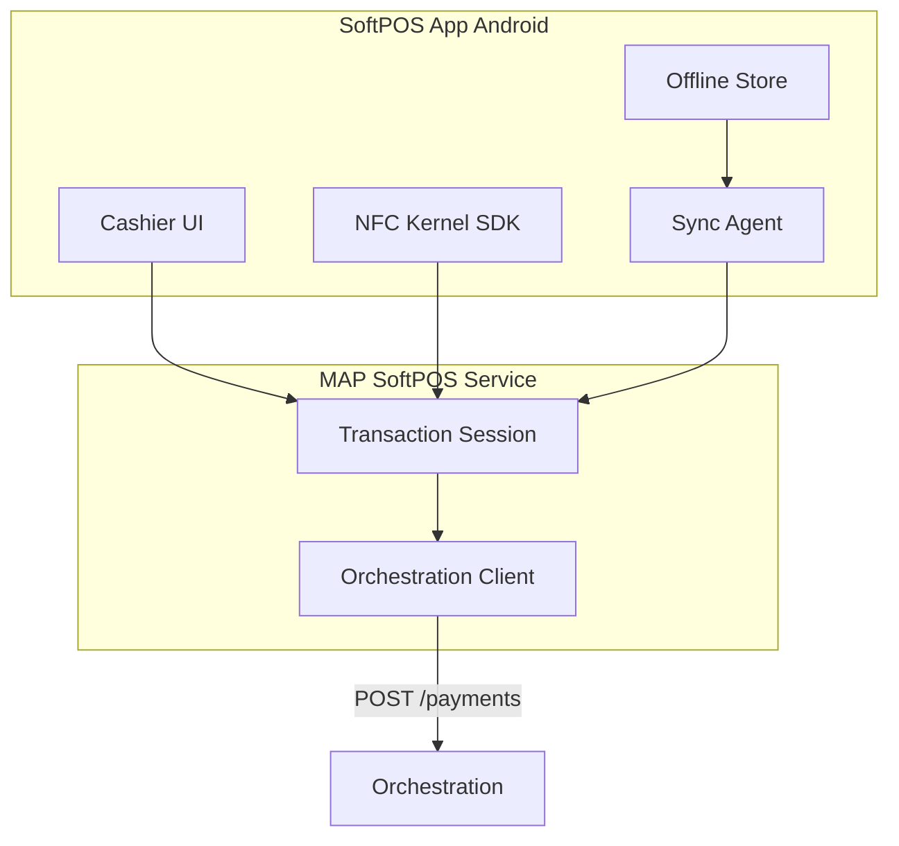
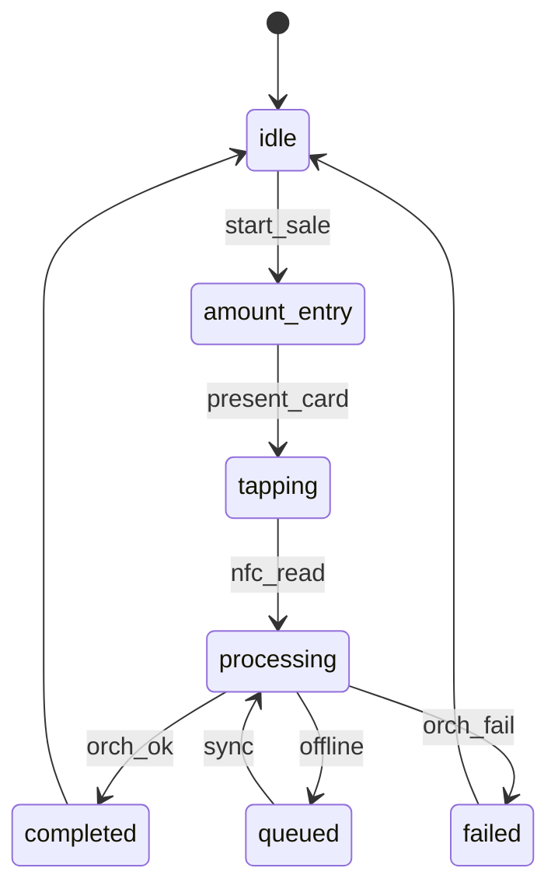
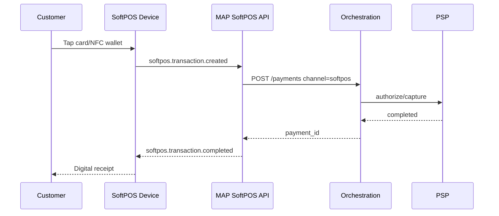

# 02 — SoftPOS

---

## Executive summary

Enterprise **SoftPOS** for Android NFC (and future iPhone Tap to Pay): merchant login, device auth, tap-to-pay, card & wallet acceptance, receipts, refunds, offline queue, sync, analytics—**all charges via Orchestration**.

---

## Business purpose

Replace dedicated POS hardware for SMEs and field merchants (daladala, markets, tourism).

---

## Architecture overview

---

## State diagram (session)

---

## Sequence: tap to pay

---

## EMV & PCI DSS

| Topic | Design |
| --- | --- |
| PAN | Only inside certified MPoC SDK / kernel |
| PIN on Glass | Where scheme + device certified |
| Scope | MAP app + SDK in CDE; MAP API out of CDE |
| Attestation | Play Integrity on activation |
| Scheme | Visa Tap to Phone / Mastercard Tap on Phone program |

---

## API specifications

See [07_API_SPECIFICATION.md](07_API_SPECIFICATION.md) § SoftPOS.

---

## Domain events

`softpos.transaction.*` — [08_EVENT_CATALOG.md](08_EVENT_CATALOG.md)

---

## AWS / security / implementation

Edge TLS; receipt S3; no PAN in MAP service logs.

---

## Operational model

Terminal config push; remote disable via Merchant device registry.

---

## Future expansion

iOS kernel; tipping; multi-merchant on one device (shift model).

---

## Cross-references

[tap_pay/02_NFC_INTEGRATION.md](../../tap_pay/02_NFC_INTEGRATION.md)
