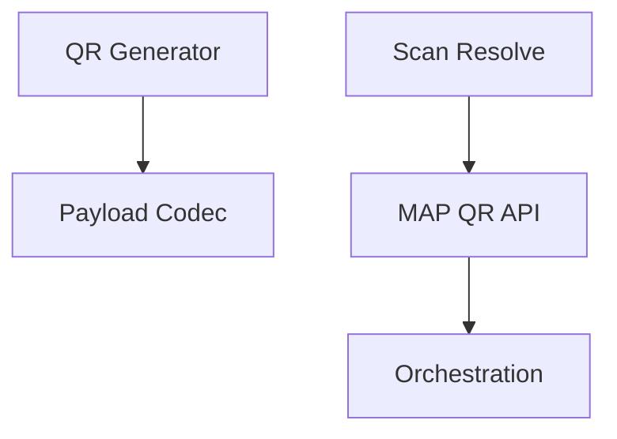
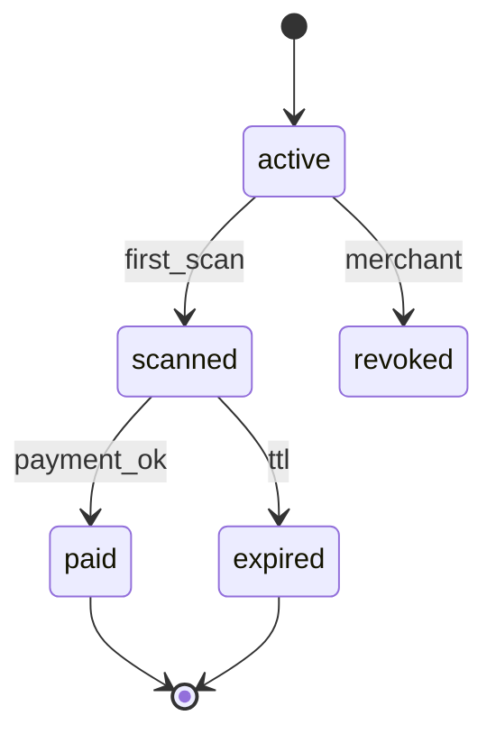
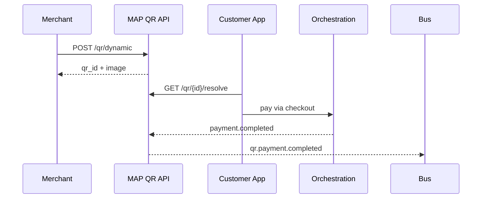

# 03 — QR Payments

---

## Executive summary

National **QR acceptance**: static, dynamic, merchant, customer, reusable, invoice, transport, government—with lifecycle, expiration, and cryptographic integrity.

---

## Business purpose

Low-cost acceptance for vendors, transit, and agencies.

---

## Architecture overview

---

## QR types

| Type | Use |
| --- | --- |
| Static | Fixed merchant receive |
| Dynamic | Amount + order ref |
| Merchant | Printed sticker |
| Customer | Payer-presented |
| Reusable | Subscriptions / passes |
| Invoice | B2B bill |
| Transport | Fare product |
| Government | Control number bind |

---

## Lifecycle state

---

## Sequence: dynamic QR

---

## Security

Signed payload (HMAC/JWS); TTL; amount tamper detection; offline validation uses signed static payloads with nonce registry.

---

## API / events / DB

[07](07_API_SPECIFICATION.md) · [08](08_EVENT_CATALOG.md) · [09](09_DATABASE_MODEL.md)

---

## AWS

CloudFront for QR images; Redis TTL.

---

## Implementation strategy

TNPI payload spec v1; EMVCo alignment roadmap.

---

## Operational model

Revoke compromised QR batches.

---

## Future expansion

Cross-wallet interoperability standard.

---

## Cross-references

[07_QR_PAYMENTS.md](../07_QR_PAYMENTS.md)
