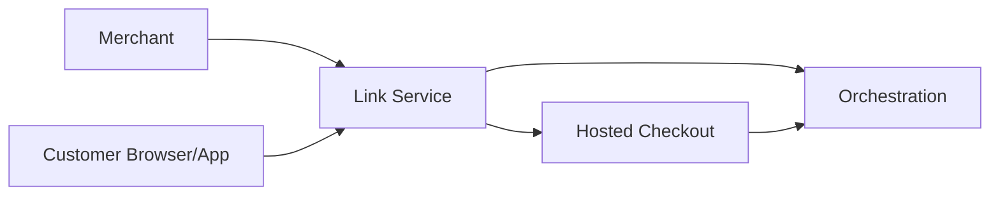
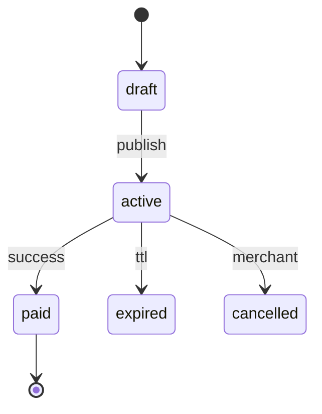
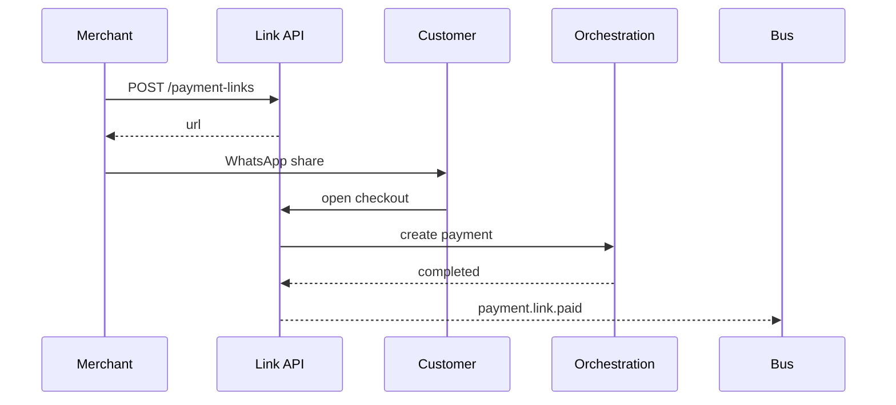

# 04 — Payment Links

---

## Executive summary

**Payment links** for requests, invoices, SMS/WhatsApp/email share, one-time and recurring, with expiry and branding.

---

## Business purpose

Remote collection without physical presence—e-commerce and informal merchants.

---

## Architecture overview

---

## Link types

| Type | Behavior |
| --- | --- |
| One-time | Single successful payment closes |
| Reusable | Multiple until cap/expiry |
| Invoice | Line items + tax hook |
| Recurring | Mandate + schedule metadata → orchestration workflow |

---

## State diagram

---

## Sequence: WhatsApp share

---

## API / events / security

Short URLs; rate limit resolve; bot protection on hosted page.

---

## AWS

CloudFront hosted checkout; WAF.

---

## Implementation strategy

Reuse Payment Sources picker UI component.

---

## Operational model

Link analytics funnel.

---

## Future expansion

Embedded buy buttons for social commerce.

---

## Cross-references

[06_TRANSACTION_FLOW.md](06_TRANSACTION_FLOW.md)
