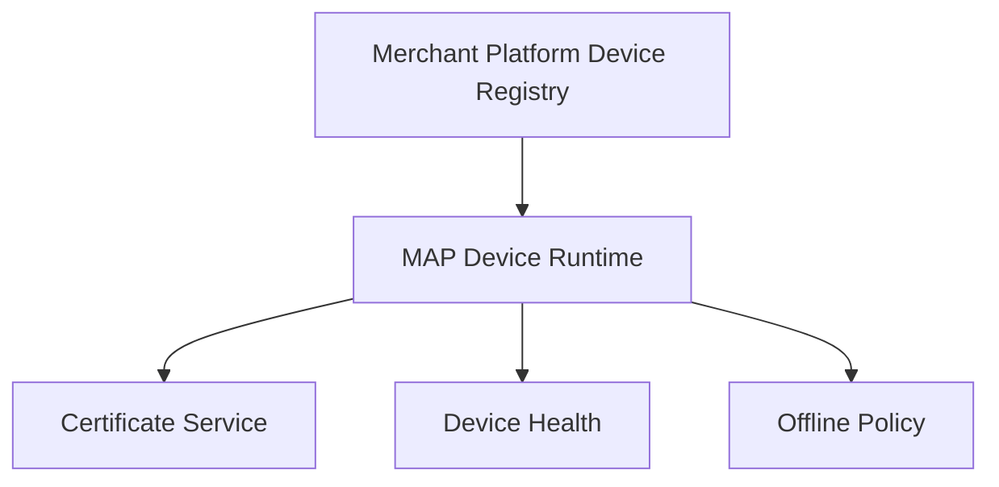
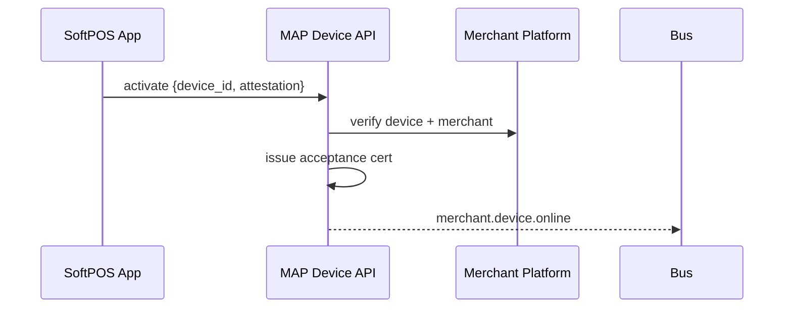
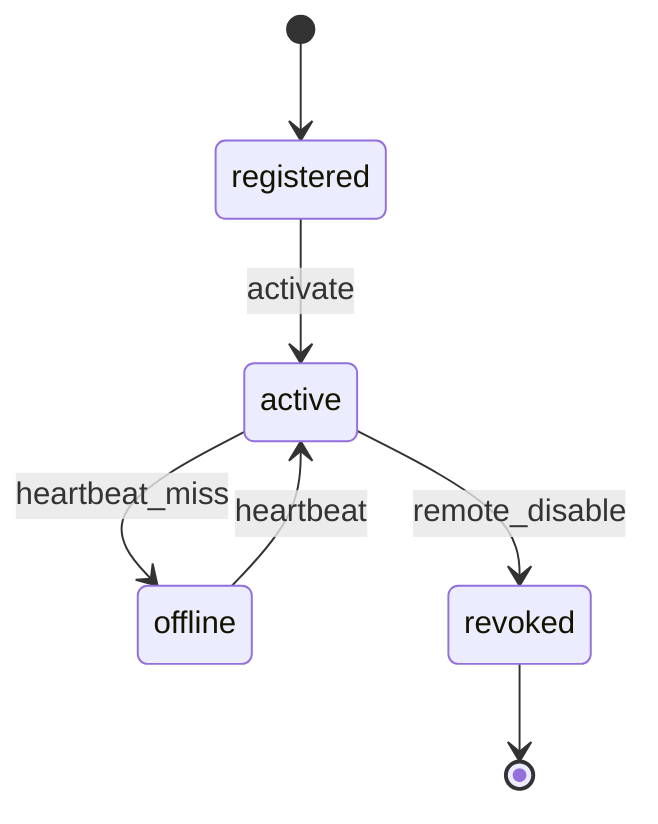

# 05 — Device Management (Acceptance)

---

## Executive summary

Acceptance-layer **device lifecycle**: registration, activation, certificates, revocation, monitoring, inventory, firmware tracking (future), remote disable—extends [Merchant Platform device registry](../merchant/05_DEVICE_MANAGEMENT.md) with runtime acceptance state.

---

## Business purpose

Trusted endpoints for SoftPOS and QR terminals.

---

## Architecture

---

## Sequence: activation

---

## State diagram

---

## API / events / DB

[07](07_API_SPECIFICATION.md) · `merchant.device.online/offline` · [09](09_DATABASE_MODEL.md)

---

## Security

Cert rotation; remote wipe command.

---

## AWS

IoT optional future; Redis last_seen.

---

## Implementation strategy

Single `device_id` across Merchant + MAP schemas via reference.

---

## Operational model

NOC dashboard for offline fleet.

---

## Future expansion

Hardware POS firmware channel.

---

## Cross-references

[merchant/05_DEVICE_MANAGEMENT.md](../merchant/05_DEVICE_MANAGEMENT.md)
