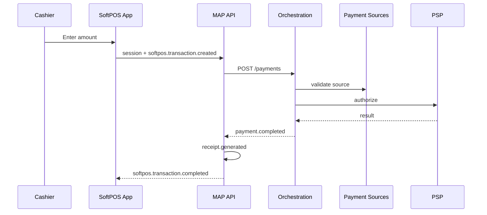
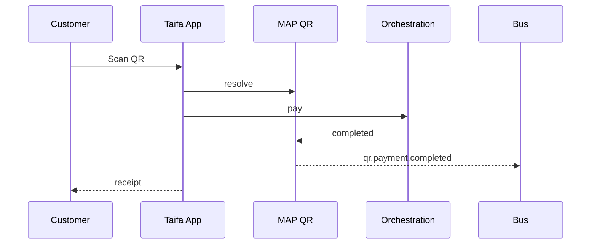
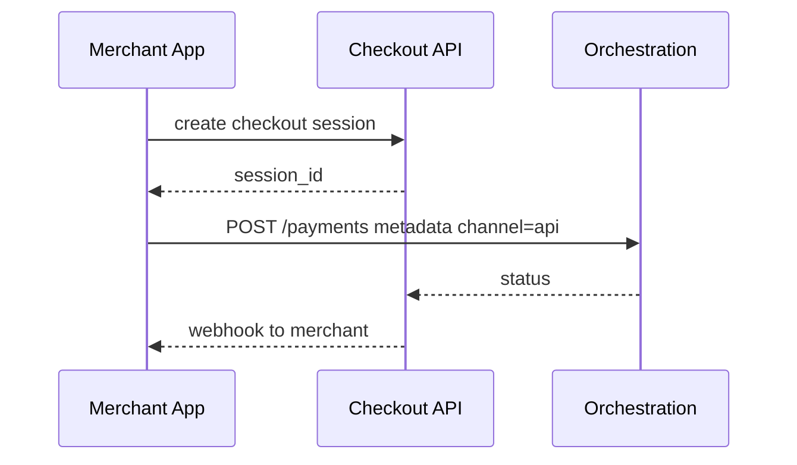
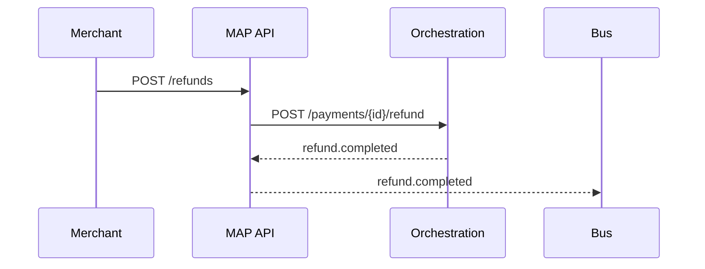
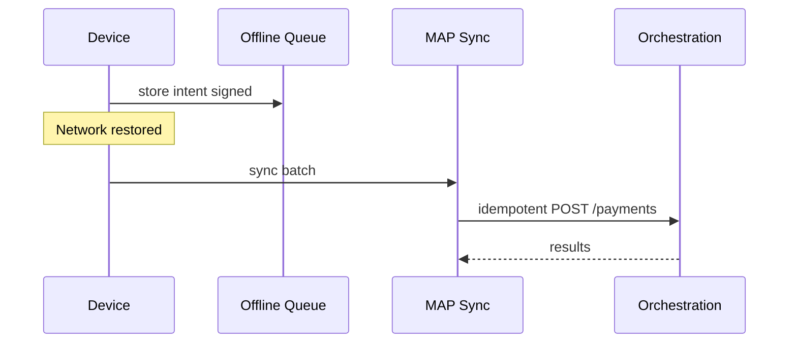

# 06 — Transaction Flows

---

## Executive summary

End-to-end **sequence diagrams** for all MAP channels—always through Orchestration.

---

## Business purpose

Shared reference for engineering and certification.

---

## SoftPOS flow

---

## QR flow

---

## Payment link flow

See [04_PAYMENT_LINKS.md](04_PAYMENT_LINKS.md).

---

## In-app / e-com checkout

---

## Refund flow

---

## Offline SoftPOS

---

## Security / AWS / implementation

Idempotency keys on sync; conflict resolution policy.

---

## Operational model

Stuck session sweeper.

---

## Future expansion

Customer display second screen flow.

---

## Cross-references

[orchestration/02_PAYMENT_LIFECYCLE.md](../orchestration/02_PAYMENT_LIFECYCLE.md)
