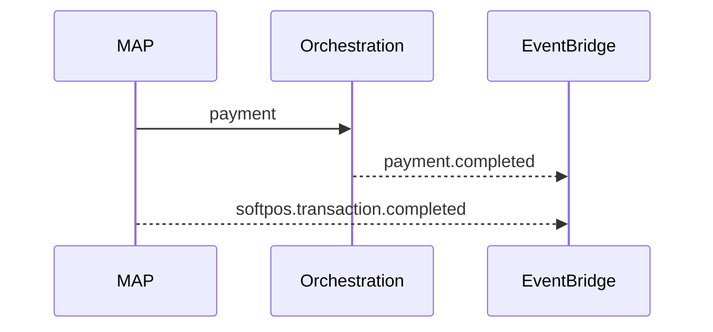

# 08 — Event Catalog (MAP)

**Prefix:** `softpos.*`, `qr.*`, `payment.link.*`, `receipt.*`, `refund.*`, `merchant.device.*`

---

## Executive summary

Acceptance-channel events; payment facts remain `payment.*` from Orchestration.

---

## SoftPOS

| event_type | When |
| --- | --- |
| `softpos.transaction.created` | Session submitted |
| `softpos.transaction.completed` | Orchestration success |
| `softpos.transaction.failed` | Failure |
| `softpos.sync.batch.completed` | Offline sync done |

---

## QR

| event_type | When |
| --- | --- |
| `qr.payment.created` | Resolve → checkout started |
| `qr.payment.completed` | Paid |
| `qr.revoked` | Merchant revoke |

---

## Payment links

| event_type | When |
| --- | --- |
| `payment.link.created` | Link published |
| `payment.link.opened` | Customer visit |
| `payment.link.paid` | Success |

---

## Receipts & refunds

| event_type | When |
| --- | --- |
| `receipt.generated` | Receipt artifact ready |
| `refund.created` | Refund initiated via MAP |
| `refund.completed` | Orchestration confirmed |

---

## Device

| event_type | When |
| --- | --- |
| `merchant.device.online` | Heartbeat OK |
| `merchant.device.offline` | Missed SLA |

---

## Sequence: dual publish

---

## Security / DB / AWS

Correlation_id links `payment_id` in all MAP events.

---

## Implementation strategy

Consumers must not double-settle on duplicate channel events.

---

## Future expansion

`checkout.session.expired`

---

## Cross-references

[orchestration/08_EVENT_CATALOG.md](../orchestration/08_EVENT_CATALOG.md)
