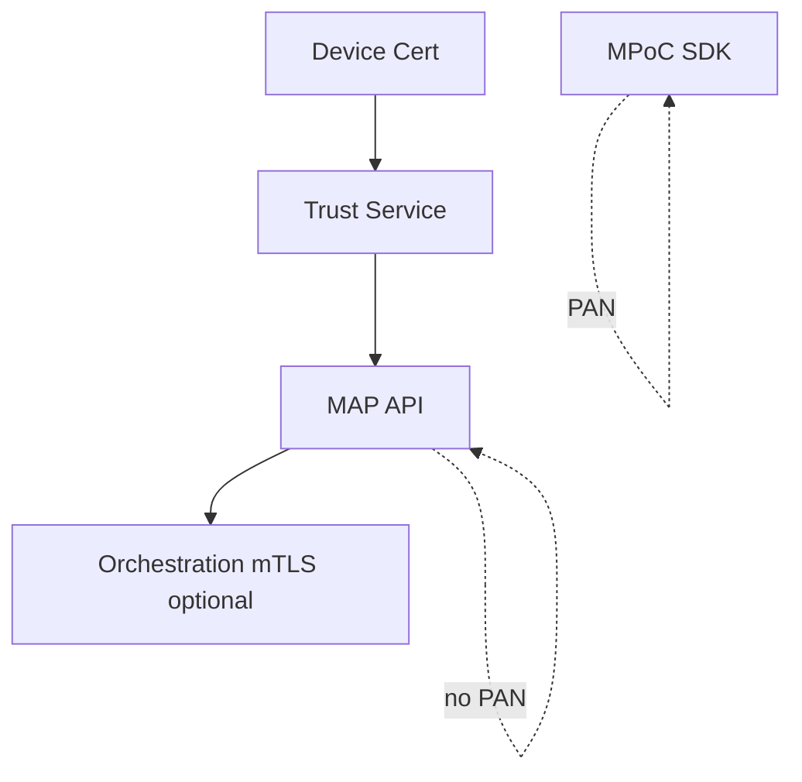

# 10 — Security Model

---

## Executive summary

Device authentication, trust, JWT/OAuth2, certificates, PCI/EMV, encryption, tokenization, secure NFC, QR integrity, webhook signing.

---

## Business purpose

Acceptance is the public attack surface for card and NFC fraud.

---

## Architecture

---

## Controls

| Area | Control |
| --- | --- |
| Device | Cert + attestation + remote disable |
| Merchant user | OIDC + cashier role |
| NFC | EMV kernel in SDK only |
| QR | Signed payloads, TTL |
| Links | Token entropy, HTTPS only |
| PCI | CDE boundary at SDK; MAP API SAQ A |
| Webhooks | HMAC to merchant |

---

## API / events / AWS

KMS, Secrets Manager, WAF, rate limits.

---

## Implementation strategy

QSA engagement before SoftPOS pilot.

---

## Operational model

Cert expiry alerts 30d prior.

---

## Future expansion

Hardware SE integration.

---

## Cross-references

[merchant-acceptance/02_SOFTPOS.md](02_SOFTPOS.md)
