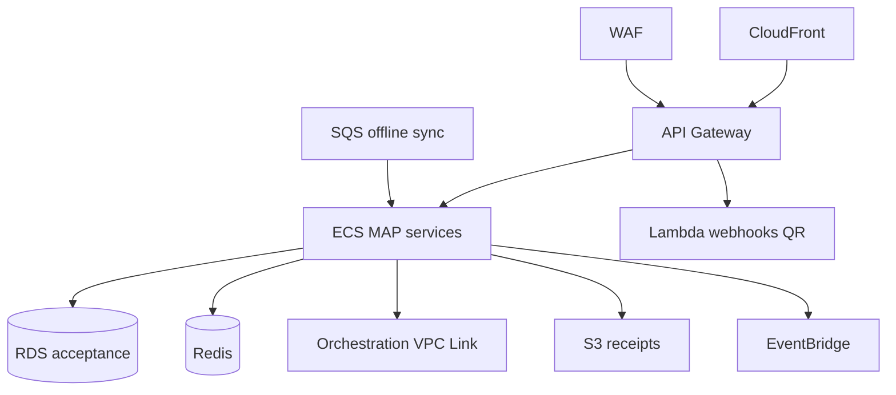

# 11 — AWS Architecture

---

## Executive summary

MAP on API Gateway, CloudFront (hosted checkout, QR CDN), ECS Fargate, Lambda, RDS, Redis, EventBridge, SQS, observability & security stack.

---

## Business purpose

Scale acceptance peaks (markets, events, rush hour transit).

---

## Component diagram

---

## Security / operational model

Multi-AZ; autoscale on session rate; CloudTrail; GuardDuty; Backup.

---

## Implementation strategy

Separate ECS service per channel (softpos, qr, links).

---

## Future expansion

Edge caching for static QR assets globally.

---

## Cross-references

[orchestration/11_AWS_ARCHITECTURE.md](../orchestration/11_AWS_ARCHITECTURE.md)
