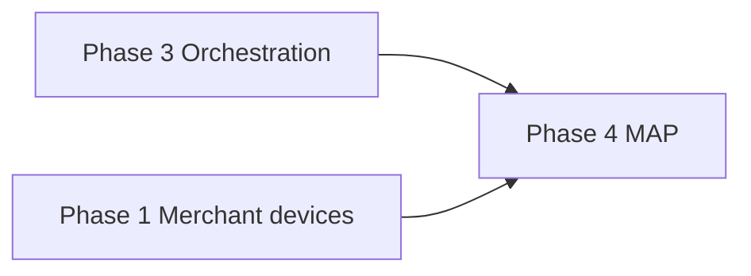

# 12 — Implementation Guide

---

## Executive summary

Phase 4 MAP delivery: SoftPOS MVP → QR → links → checkout → offline → hardening; **orchestration client mandatory**.

---

## Business architecture

---

## Stages

| Stage | Weeks | Deliverable |
| --- | --- | --- |
| MA-0 | 2 | OpenAPI, schema, orchestration SDK |
| MA-1 | 5 | SoftPOS Android MVP + sandbox pay |
| MA-2 | 4 | QR static/dynamic |
| MA-3 | 3 | Payment links + hosted checkout |
| MA-4 | 3 | In-app/e-com checkout API |
| MA-5 | 3 | Offline queue + sync |
| MA-6 | 2 | Receipts, analytics views |
| MA-7 | 2 | Certification prep + gate |

---

## Implementation strategy

Strangler from `tap_pay` + `acceptance` Django apps; flag `tnpi.map`.

---

## Operational model

Runbooks per channel; on-call playbooks.

---

## Future roadmap

iOS SoftPOS; wearables.

---

## Cross-references

[14_BACKLOG.md](14_BACKLOG.md) · [PHASE4_GATE_PACKAGE.md](PHASE4_GATE_PACKAGE.md)
