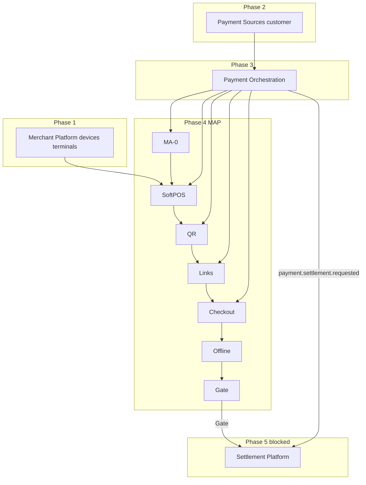

# TNPI Phase 4 — Gate Package (Merchant Acceptance Platform)

**Status:** Architecture planning complete — Phase 3 Orchestration gate assumed **approved**  
**Date:** 2026-08-06

---

## 1. Product Readiness Report

### Executive summary

The **Merchant Acceptance Platform (MAP)** pack (`docs/payments/merchant-acceptance/00–17`) defines TNPI Phase 4: **SoftPOS, QR, payment links, checkout, receipts, offline sync**—all **consuming Payment Orchestration**—without settlement, reconciliation, or fraud engine implementation.

### Readiness matrix

| Dimension | Status |
| --- | --- |
| Product vision & capability model | ✅ |
| SoftPOS, QR, links, flows | ✅ |
| APIs, events, data model | ✅ |
| Security (PCI/EMV), AWS | ✅ |
| Implementation, backlog, acceptance, risks | ✅ |
| **Implementation code** | ⬜ |
| **Scheme certification (SoftPOS)** | ⬜ |
| **Phase 3 Orchestration live staging** | ✅ assumed |

### Verdict

| Question | Answer |
| --- | --- |
| Start MAP **implementation** (architecture)? | **Yes** |
| National SoftPOS production? | **After** §6 + certification |
| Start **Settlement Platform** (Phase 5)? | **After** §5 exit criteria |

### Sign-off (post-implementation)

| Role | Date |
| --- | --- |
| TNPI Product Lead | |
| Acceptance Architect | |
| Security / PCI | |
| Mobile Lead | |

---

## 2. Sprint Plan

| Sprint | Duration | Focus | Backlog |
| --- | --- | --- | --- |
| **MA-0** | 2 wk | OpenAPI, schema, orch SDK | MAB-001–002 |
| **MA-1** | 5 wk | SoftPOS MVP, refunds, device health | MAB-003–005, 013–014 |
| **MA-2** | 4 wk | QR static/dynamic | MAB-006–007 |
| **MA-3** | 3 wk | Payment links + hosted page | MAB-008–009 |
| **MA-4** | 3 wk | Checkout API, tax hooks | MAB-010, 016 |
| **MA-5** | 3 wk | Offline queue + sync | MAB-011 |
| **MA-6** | 2 wk | Receipts, history, a11y | MAB-012, 015, 017 |
| **MA-7** | 2 wk | Load test, gate evidence | MAB-018–019 |

Detail: [12_IMPLEMENTATION_GUIDE.md](12_IMPLEMENTATION_GUIDE.md) · [14_BACKLOG.md](14_BACKLOG.md)

---

## 3. Dependency Graph

**Hard rule:** MAP services hold **no** PSP credentials for charging—only Orchestration client credentials.

---

## 4. Architecture Review

### Scope

MAP vs Orchestration vs Merchant device registry vs legacy `tap_pay` / `acceptance` apps.

### Findings

| ID | Finding | Severity | Action |
| --- | --- | --- | --- |
| AR-MAP-01 | Clear separation MAP → Orchestration only | ✅ | Enforce in code review |
| AR-MAP-02 | Duplicate device models Merchant vs MAP runtime | Medium | `merchant_device_ref` pattern in [09](09_DATABASE_MODEL.md) |
| AR-MAP-03 | Offline queue idempotency critical | High | MAB-011 + MAP-01 mitigation |
| AR-MAP-04 | PCI CDE at SDK not MAP API | ✅ | Security sign-off |
| AR-MAP-05 | Tourism/mobility use MAP checkout metadata | Medium | Channel enums align orchestration workflows |
| AR-MAP-06 | Settlement must not be triggered from MAP directly | High | Only orchestration emits settlement.requested |

### Proposed ADRs

| ADR | Topic |
| --- | --- |
| ADR-TNPI-MAP-001 | Mandatory orchestration for all acceptance channels |
| ADR-TNPI-MAP-002 | MAP event + orchestration `payment.*` dual subscription policy for analytics |

### Verdict

**Approved to proceed with Phase 4 implementation** when Phase 3 orchestration API is frozen in staging.

---

## 5. Exit Criteria — Phase 5 (Settlement Platform)

Phase 5 per [04_SETTLEMENT.md](../04_SETTLEMENT.md) / [05_RECONCILIATION.md](../05_RECONCILIATION.md) may start when:

| # | Criterion |
| --- | --- |
| E1 | [15_ACCEPTANCE_CRITERIA.md](15_ACCEPTANCE_CRITERIA.md) AC-F1–F8 passed in staging |
| E2 | Phase 4 gate package signed (§1) |
| E3 | SoftPOS + QR + links each completed ≥1 real sandbox payment via orchestration |
| E4 | MPoC / scheme certification **plan** approved (production cert may run parallel) |
| E5 | Offline sync chaos test passed |
| E6 | MAP produces no `settlement` or `recon` batch logic—verified architecture audit |
| E7 | Orchestration emitting `payment.settlement.requested` on completed payments (Phase 3) |
| E8 | Merchant acceptance analytics reconciles **orchestration** payment counts (not MAP session alone) |
| E9 | Pilot merchants (≥10) using MAP channels in controlled staging |
| E10 | Risk register MAP P1 items mitigated or waived with ADR |

---

## 6. Production Readiness Assessment

| Area | Staging pilot | National production |
| --- | --- | --- |
| SoftPOS scheme certification | Required before card live | **Blocker** |
| API scale (acceptance) | MA-7 load test | Auto-scale ECS |
| CloudFront checkout | MA-3 | WAF rules prod |
| DR / backup | RDS backup test | RTO 1h |
| On-call / runbooks | MA-7 | Required |
| Regulatory (BoT) live acceptance | N/A staging | Partner sign-off |
| Fraud engine | Out of scope Phase 4 | Phase 3+ hook only |

### Verdict

| Stage | Ready? |
| --- | --- |
| Architecture (now) | **Yes** |
| Staging MAP pilot | After MA-1–MA-3 |
| National MAP production | **No** until certification + §6 ops + E2 sign-off |

---

## Cross-references

[00_INDEX.md](00_INDEX.md) · [orchestration/PHASE3_GATE_PACKAGE.md](../orchestration/PHASE3_GATE_PACKAGE.md)
