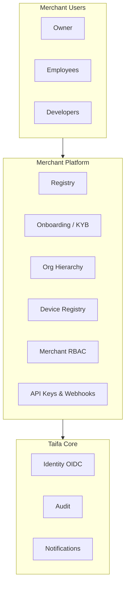

# 01 — Merchant Platform Product Vision

---

## Executive summary

The **Merchant Platform** is TNPI’s first production product: the **trusted digital identity** of every business that accepts payments through Taifa—from street vendors to national railways. It delivers registration, verification, hierarchy, workforce, devices, settlement account metadata, and developer access—**before** any payment rail is switched on.

---

## Business purpose

Tanzania’s economy runs on millions of acceptance points. Without a single, auditable merchant identity layer, orchestration, fraud, settlement, and government reporting cannot scale. The Merchant Platform becomes the **system of record for “who is allowed to accept.”**

---

## Product vision

**One merchant, one truth—nationwide.**

Every shop, hotel, hospital, school, agency, daladala operator, and tour desk gets:

- Verified legal identity (KYB)
- Organizational structure (head office → branch → department)
- Role-based workforce
- Registered devices (future SoftPOS / QR / POS)
- Settlement account linkage (metadata for Phase 2+)
- API keys and webhooks for integrators
- Dashboard for operations—not payment processing in Phase 1

---

## Architecture (conceptual)

---

## Target merchant segments

| Segment | Examples |
| --- | --- |
| Retail | Shops, supermarkets, pharmacies, fuel |
| Hospitality | Hotels, restaurants |
| Public sector | Hospitals, schools, agencies |
| Mobility | Daladala, BRT, TRC, SGR, airlines |
| Tourism | Operators, parks, guides |
| Informal / SME | Vendors, market traders |

---

## Success metrics (Phase 1)

| Metric | Target (pilot) |
| --- | --- |
| Onboarding completion rate | ≥ 70% |
| KYB decision SLA | ≤ 5 business days |
| API availability (merchant APIs) | 99.9% staging |
| Audit coverage | 100% state changes |

---

## Security considerations

Merchant PII and documents are high sensitivity; RBAC and audit are first-class. PCI scope in Phase 1 is **minimal** (no card processing)—prepare device trust model for Phase 3.

---

## Implementation strategy

Deliver as **`finance.merchant`** microservice(s) on Taifa Core; strangler from any legacy merchant tables in `payments/` / `enterprise/` only behind ports.

---

## Future expansion

- Marketplace sub-merchants
- White-label branding per chain
- Cross-border merchant passport (EAC)
- Payment orchestration hooks (Phase 2) read-only from merchant profile

---

## Cross-references

[02_BUSINESS_CAPABILITIES.md](02_BUSINESS_CAPABILITIES.md) · [04_MERCHANT_ONBOARDING.md](04_MERCHANT_ONBOARDING.md)
