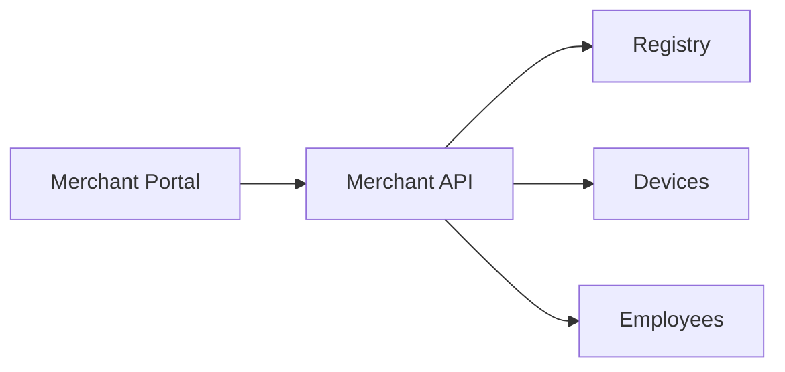
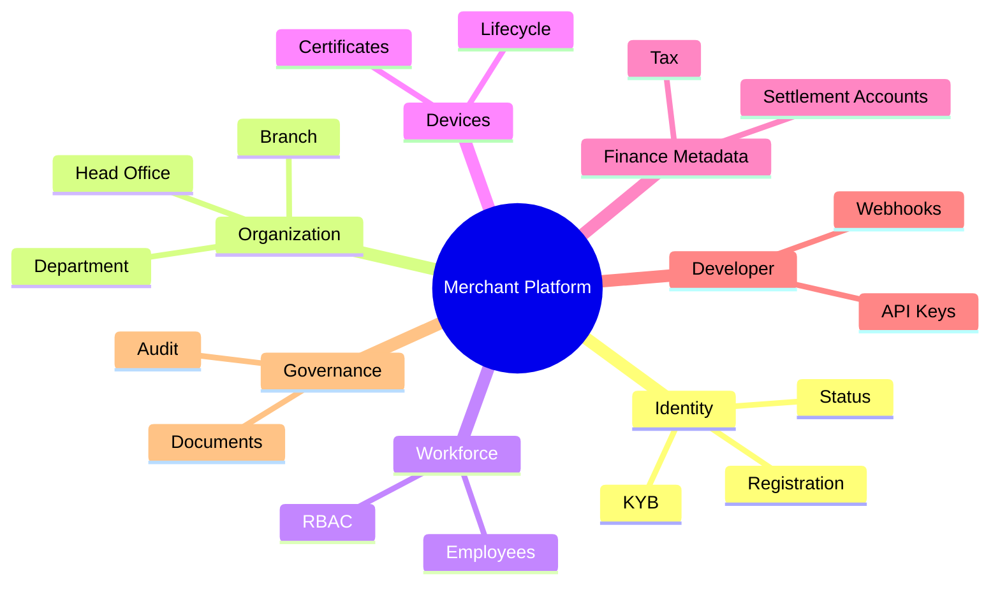

# 02 — Business Capabilities

---

## Executive summary

Capability map for the Merchant Platform across registration, verification, organization, workforce, devices, settlement metadata, compliance artifacts, developer access, and observability—**excluding payment execution**.

---

## Business purpose

Provide a checklist for product, engineering, and compliance to ensure Phase 1 is complete before Phase 2 (Payment Sources / orchestration).

---

## Capability matrix

| Capability | Description | Phase 1 |
| --- | --- | --- |
| Merchant registration | Legal entity creation, TIN, contact | ● |
| Merchant verification | Identity of beneficial owners | ● |
| Business verification (KYB) | Documents, licenses, review workflow | ● |
| Merchant profiles | Trade name, MCC, branding | ● |
| Merchant categories | MCC / vertical taxonomy | ● |
| Branches | Physical / logical sites | ● |
| Employees | Invites, membership | ● |
| Roles & permissions | RBAC + custom roles | ● |
| Devices | Register, activate, revoke | ● |
| Terminals | Logical terminal IDs (SoftPOS/QR **registration only**) | ● |
| Wallet connections | **Stub** — link metadata for Phase 2 | ○ metadata |
| Settlement accounts | Bank / mobile money payout destinations (metadata) | ● |
| Tax information | TIN, VAT status | ● |
| Licenses | Trade license refs | ● |
| Documents | Secure upload & retention | ● |
| Contracts | Commercial terms record | ● |
| Notifications | Onboarding & status (via Core) | ● |
| Preferences | Locale, receipt defaults | ● |
| Branding | Logo, display name | ● |
| Status | Lifecycle state machine | ● |
| Audit logs | Immutable trail | ● |
| API keys | Developer access | ● |
| Webhooks | Endpoint registration | ● |
| Analytics | Onboarding funnel, active merchants | ● |
| Reports | Merchant roster, KYB queue | ● |
| **Payments** | Processing | ✗ Phase 2+ |
| **Settlements execution** | Batches | ✗ Phase 2+ |

### Merchant dashboard (Phase 1)

| Module | Scope |
| --- | --- |
| Profile, branding, preferences | ● |
| Branches, departments | ● |
| Devices, terminals | ● |
| Employees, roles | ● |
| Settlement accounts | ● metadata |
| API keys, webhooks, developer settings | ● |
| Notifications | ● |
| Payments, settlements, pay analytics | Placeholder — Phase 2+ |

---

## Architecture

---

## Domain model (summary)

See [03_DOMAIN_MODEL.md](03_DOMAIN_MODEL.md).

---

## API & events

[07_API_SPECIFICATION.md](07_API_SPECIFICATION.md) · [08_EVENT_CATALOG.md](08_EVENT_CATALOG.md)

---

## AWS architecture

[11_AWS_ARCHITECTURE.md](11_AWS_ARCHITECTURE.md)

---

## Security considerations

Least privilege per capability; segregate ops vs merchant admin vs developer scopes.

---

## Implementation strategy

Prioritize **onboarding + hierarchy + RBAC** before devices and developer portal polish.

---

## Future expansion

Payment history widgets in dashboard (read models from Phase 2); SoftPOS activation workflows (Phase 3).

---

## Cross-references

[14_BACKLOG.md](14_BACKLOG.md)
