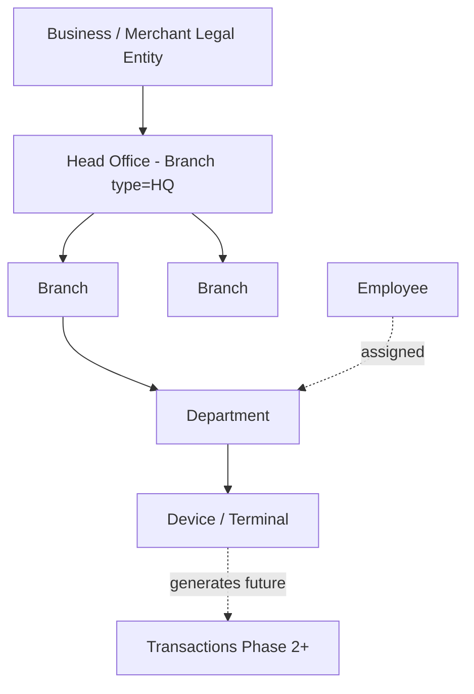
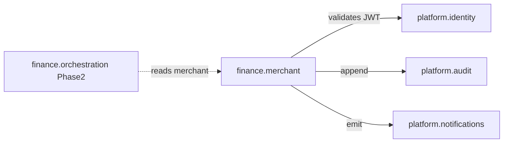
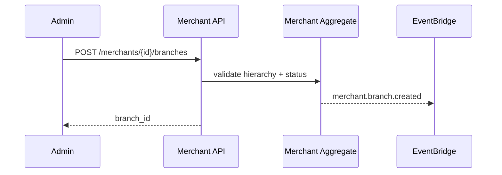

# 03 — Domain Model

**Bounded context:** `finance.merchant`

---

## Executive summary

DDD model for merchant digital identity: aggregates for **Merchant**, **Branch**, **Employee**, **Device**, **SettlementAccount**, and supporting entities—with clear invariants for enterprise hierarchies scaling to thousands of branches.

---

## Business purpose

Single ubiquitous language for TNPI Phase 1 engineering and API design.

---

## Merchant hierarchy

---

## Aggregates & invariants

| Aggregate | Root | Invariants |
| --- | --- | --- |
| `Merchant` | `merchant_id` | One active legal identity per TIN (configurable dedup); status gates all mutations |
| `Branch` | `branch_id` | Belongs to one merchant; tree depth ≤ 6 |
| `OrgUnit` | `org_unit_id` | Department under branch; optional |
| `Employee` | `employee_id` | One user ↔ many merchant memberships |
| `RoleAssignment` | composite | Role scoped to merchant or branch |
| `Device` | `device_id` | Bound to branch; one active enrollment |
| `SettlementAccount` | `settlement_account_id` | Verified before `merchant.approved` for live-ready |
| `VerificationCase` | `case_id` | Drives onboarding state machine |
| `ApiKey` | `key_id` | Hashed secret; scopes |
| `WebhookEndpoint` | `webhook_id` | HTTPS only; secret rotation |

---

## Context map

---

## Sequence: create branch under HQ

---

## Value objects

| VO | Fields |
| --- | --- |
| `TaxId` | TIN, VAT number |
| `Address` | region, district, street, geo |
| `MccCode` | ISO 18245 |
| `PhoneNumber` | E.164 |
| `DocumentRef` | S3 key + type |

---

## API specifications

CRUD on aggregates per [07_API_SPECIFICATION.md](07_API_SPECIFICATION.md).

---

## Events

[08_EVENT_CATALOG.md](08_EVENT_CATALOG.md)

---

## AWS architecture

Service owns merchant schema in RDS; documents in S3.

---

## Security considerations

No payment credentials in merchant aggregate; settlement account = destination metadata only.

---

## Implementation strategy

Hexagonal: `domain/` → `application/` → `ports/` → `adapters/` under future `taifa_platform/merchant/` or dedicated service repo module.

---

## Future expansion

`PartnerMerchant` for aggregators; `Franchisee` relationship type.

---

## Cross-references

[09_DATABASE_MODEL.md](09_DATABASE_MODEL.md)
