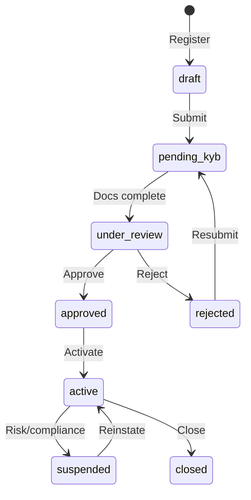
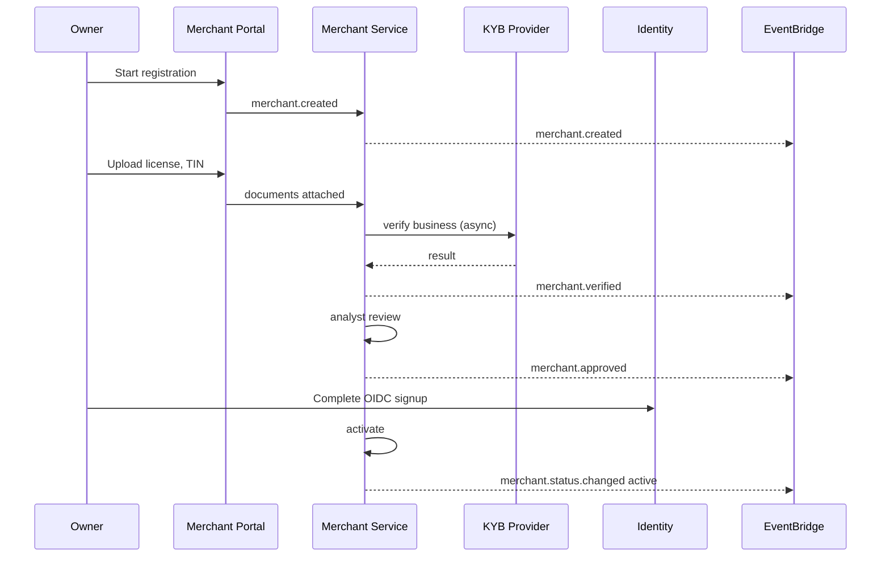

# 04 — Merchant Onboarding

---

## Executive summary

End-to-end **KYB onboarding** from business registration through verification, document review, approval, and **merchant ready**—with explicit state machine and integration to Taifa Core Identity and Audit.

---

## Business purpose

Only verified merchants receive live credentials and device enrollment; reduces fraud and regulatory exposure before Phase 2 payments.

---

## Onboarding workflow

| State | Meaning |
| --- | --- |
| `draft` | Incomplete application |
| `pending_kyb` | Awaiting documents |
| `under_review` | Analyst queue |
| `approved` | KYB passed; pre-activation |
| `active` | **Merchant ready** — devices, API keys allowed |
| `suspended` | Block new devices/keys |
| `rejected` | Terminal with reason |
| `closed` | Offboarded |

---

## Sequence: full onboarding

---

## Domain model

- `VerificationCase` links documents, checks, analyst decisions
- `Merchant.status` derived from case + compliance flags

---

## API specifications

| Method | Path | Action |
| --- | --- | --- |
| POST | `/api/v1/merchants` | Create draft |
| POST | `/api/v1/merchants/{id}/submit` | → pending_kyb |
| POST | `/api/v1/merchants/{id}/documents` | Upload |
| POST | `/api/v1/merchants/{id}/verification` | Trigger checks |
| POST | `/internal/merchants/{id}/approve` | Ops approve |
| POST | `/api/v1/merchants/{id}/activate` | → active |

---

## Events

`merchant.created`, `merchant.verified`, `merchant.approved`, `merchant.status.changed`

---

## AWS architecture

Step Functions optional for KYB async; S3 for documents; virus scan Lambda.

---

## Security considerations

Document encryption KMS; analyst dual-control for high-risk MCCs; PII retention policy.

---

## Implementation strategy

MVP: manual review queue; v2: BRELA/TIN API adapters.

---

## Future expansion

Tiered KYB (micro-merchant fast track); video KYC for owners.

---

## Cross-references

[15_ACCEPTANCE_CRITERIA.md](15_ACCEPTANCE_CRITERIA.md)
