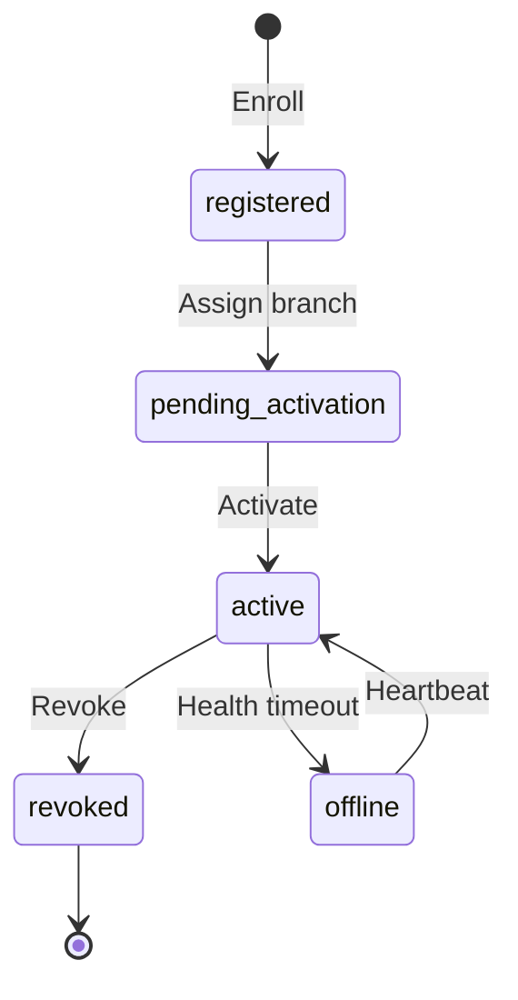
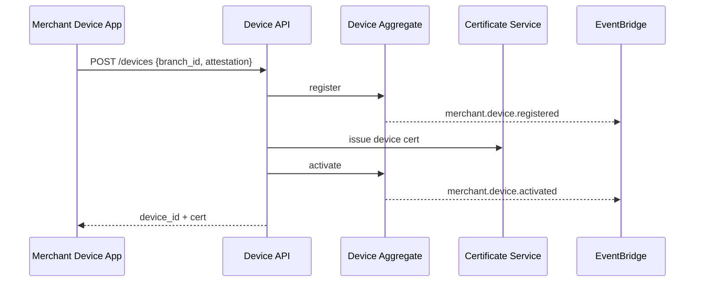

# 05 — Device Management

---

## Executive summary

**Device lifecycle** for merchant acceptance endpoints: registration, activation, authentication, revocation, certificates, SoftPOS/QR **terminal registration** (no payment processing), offline capability flags, health and monitoring.

---

## Business purpose

Every future tap, scan, or POS transaction must bind to a **known, trusted device** under a branch.

---

## Architecture

---

## Device types (Phase 1 registry)

| Type | Phase 1 | Later |
| --- | --- | --- |
| `softpos_android` | Register + cert placeholder | Phase 3 transactions |
| `qr_terminal` | Register static QR id | Phase 3 pay |
| `hardware_pos` | Metadata only | Partner integrations |
| `offline_capable` | Flag + sync policy doc | Phase 3 sync |

---

## Sequence: device activation

---

## Domain model

`Device`: `device_id`, `merchant_id`, `branch_id`, `type`, `status`, `last_seen_at`, `certificate_ref`, `attestation_level`

---

## API specifications

| Method | Path |
| --- | --- |
| POST | `/api/v1/merchants/{id}/devices` |
| POST | `/api/v1/devices/{id}/activate` |
| POST | `/api/v1/devices/{id}/revoke` |
| GET | `/api/v1/devices/{id}/health` |
| POST | `/api/v1/devices/{id}/heartbeat` |

---

## Events

`merchant.device.registered`, `merchant.device.activated`, `merchant.device.revoked`

---

## AWS architecture

IoT Core optional future; Phase 1: RDS + Secrets Manager for cert keys; CloudWatch device metrics.

---

## Security considerations

Device attestation (Play Integrity); cert rotation; revoke propagates to API GW deny list cache.

---

## Implementation strategy

Build registry + lifecycle first; cert authority partner or internal CA decision in Sprint MP-4.

---

## Future expansion

MDM integration; remote wipe; PIN on Glass device profiles.

---

## Cross-references

[06_SOFTPOS.md](../06_SOFTPOS.md) (Phase 3) · [10_SECURITY_MODEL.md](10_SECURITY_MODEL.md)
