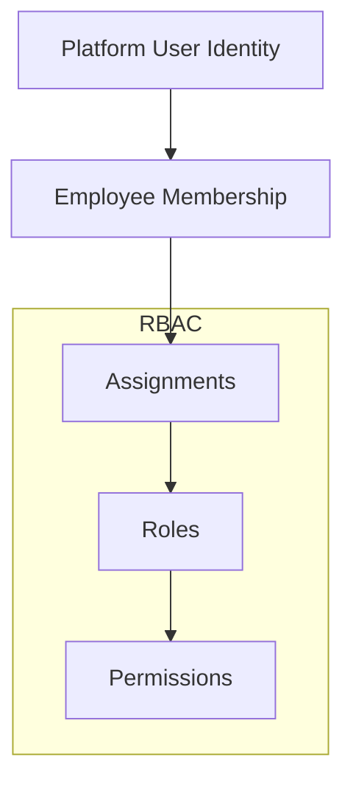
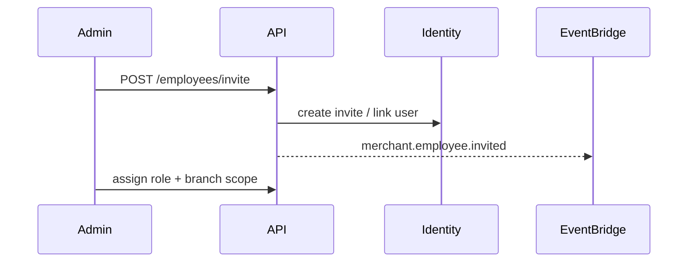

# 06 — Employee Management

---

## Executive summary

Workforce management: invites, membership, **RBAC** (owner, admin, manager, cashier, finance, auditor, developer, support, custom roles), scoped to merchant or branch.

---

## Business purpose

Thousands of cashiers across branches must operate with least privilege; developers get scoped API access separate from finance.

---

## Architecture

---

## Standard roles

| Role | Typical permissions |
| --- | --- |
| `owner` | All merchant actions |
| `administrator` | Users, branches, devices, settings |
| `manager` | Branch ops, reports, employees |
| `cashier` | Device use (future pay), view shift |
| `finance_officer` | Settlement accounts, reports |
| `auditor` | Read-only audit + reports |
| `developer` | API keys, webhooks (no KYB) |
| `support_agent` | Taifa internal (scoped impersonation policy) |
| `custom_*` | Merchant-defined permission bundles |

**ABAC extensions:** branch_id, MCC, amount limits (enforced Phase 2+ on payments; defined Phase 1).

---

## Sequence: invite employee

---

## Domain model

`Employee`, `Role`, `Permission`, `RoleAssignment` (see [09_DATABASE_MODEL.md](09_DATABASE_MODEL.md))

---

## API specifications

| Method | Path |
| --- | --- |
| POST | `/api/v1/merchants/{id}/employees/invite` |
| GET | `/api/v1/merchants/{id}/employees` |
| PATCH | `/api/v1/merchants/{id}/employees/{eid}` |
| DELETE | `/api/v1/merchants/{id}/employees/{eid}` |
| PUT | `/api/v1/merchants/{id}/employees/{eid}/roles` |

---

## Events

`merchant.employee.invited`, `merchant.employee.removed`, `merchant.employee.role_changed`

---

## AWS architecture

Identity sync via Core OIDC; merchant service stores assignments only.

---

## Security considerations

Separation of developer vs finance; MFA for owner/admin; session management via Core.

---

## Implementation strategy

Permission catalog versioned; breaking changes require migration script.

---

## Future expansion

SSO for enterprise chains; time-bound cashier shifts.

---

## Cross-references

[10_SECURITY_MODEL.md](10_SECURITY_MODEL.md)
