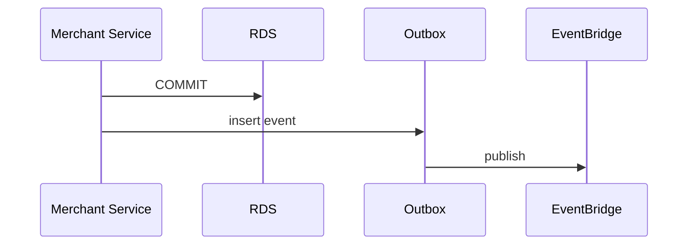

# 08 — Event Catalog (Merchant Platform)

**Envelope:** [event-envelope-v1.json](../../platform/schemas/event-envelope-v1.json)  
**Bus:** `tnpi-platform` / federated Core bus  
**Prefix:** `merchant.*`

---

## Executive summary

Merchant Platform events for lifecycle, organization, devices, workforce, developer credentials, and status—consumed by audit, notifications, risk (future), and Phase 2 orchestration (read-only gates).

---

## Business purpose

Decouple merchant SoR from downstream systems; no cross-service DB access.

---

## Event catalog

| event_type | Payload summary | Producer |
| --- | --- | --- |
| `merchant.created` | merchant_id, legal_name, mcc, status=draft | Merchant Service |
| `merchant.updated` | changed_fields[] | Merchant Service |
| `merchant.verified` | case_id, checks_passed | KYB |
| `merchant.approved` | approved_by, effective_at | KYB/Ops |
| `merchant.suspended` | reason_code | Risk/Ops |
| `merchant.status.changed` | old_status, new_status | Merchant Service |
| `merchant.branch.created` | branch_id, parent_id | Merchant Service |
| `merchant.branch.updated` | branch_id | Merchant Service |
| `merchant.device.registered` | device_id, type, branch_id | Device API |
| `merchant.device.activated` | device_id, cert_ref | Device API |
| `merchant.device.revoked` | device_id, reason | Device API |
| `merchant.employee.invited` | employee_id, email, roles[] | Employee API |
| `merchant.employee.removed` | employee_id | Employee API |
| `merchant.employee.role_changed` | employee_id, roles[] | Employee API |
| `merchant.api_key.created` | key_id, scopes (no secret) | Developer API |
| `merchant.api_key.revoked` | key_id | Developer API |
| `merchant.webhook.created` | webhook_id, url_masked | Developer API |
| `merchant.webhook.updated` | webhook_id | Developer API |
| `merchant.settlement_account.added` | account_id, type | Merchant Service |
| `merchant.settlement_account.verified` | account_id | Merchant Service |
| `merchant.document.uploaded` | document_id, type | Merchant Service |

---

## Example payload (`merchant.approved`)

```json
{
  "event_id": "uuid",
  "event_type": "merchant.approved",
  "occurred_at": "2026-08-06T10:00:00Z",
  "correlation_id": "uuid",
  "tenant_id": "merchant_uuid",
  "payload": {
    "merchant_id": "uuid",
    "verification_case_id": "uuid",
    "mcc": "5812",
    "approved_by": "ops_user_id"
  }
}
```

---

## Sequence: event after commit



---

## Domain model

Events mirror aggregate transitions — [03_DOMAIN_MODEL.md](03_DOMAIN_MODEL.md).

---

## API specifications

N/A (async); webhook **delivery** to merchants is Phase 2 platform—registration in Phase 1.

---

## AWS architecture

EventBridge rules → SQS subscribers; schema validation in CI.

---

## Security considerations

No document content in events; use references only.

---

## Implementation strategy

Register schemas in `docs/payments/merchant/schemas/` (future); idempotent consumers.

---

## Future expansion

`merchant.branding.updated`; compliance `merchant.kyb.expired`.

---

## Cross-references

[15_EVENT_CATALOG.md](../15_EVENT_CATALOG.md)
