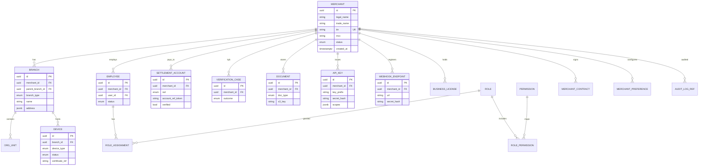

# 09 — Database Model

**Engine:** PostgreSQL 15+ (RDS Multi-AZ)  
**Schema:** `merchant` (dedicated schema or DB per service)

---

## Executive summary

Enterprise relational model for Merchant Platform entities with hierarchy, RBAC, devices, settlement metadata, documents, webhooks, API keys, notifications references, and audit linkage.

---

## Business purpose

Single SoR schema design before migrations; supports thousands of branches per merchant via indexing strategy.

---

## ER diagram (core)

---

## Key indexes

| Table | Index |
| --- | --- |
| `merchant` | `(tin)`, `(status)`, `(mcc)` |
| `branch` | `(merchant_id, parent_branch_id)` |
| `employee` | `(merchant_id, user_id)` unique |
| `device` | `(branch_id, status)` |
| `api_key` | `(key_prefix)` |

---

## Hierarchy query pattern

Closure table or `ltree` for `branch` ancestry (choose in implementation ADR).

---

## Domain model mapping

[03_DOMAIN_MODEL.md](03_DOMAIN_MODEL.md)

---

## API specifications

Persistence behind [07_API_SPECIFICATION.md](07_API_SPECIFICATION.md).

---

## Events

State changes → [08_EVENT_CATALOG.md](08_EVENT_CATALOG.md).

---

## AWS architecture

RDS Multi-AZ; read replica for search/reporting; S3 for documents; no PAN storage.

---

## Security considerations

Encrypt `account_ref_token` with KMS; row-level security optional per merchant_id for multi-tenant queries.

---

## Implementation strategy

Alembic/Django migrations isolated in merchant service; no FK to payment tables in Phase 1.

---

## Future expansion

Partition `audit_log_ref` by month; read models for dashboard search (OpenSearch).

---

## Cross-references

[DATA_MODEL.md](../../DATA_MODEL.md) — legacy alignment notes in implementation guide
