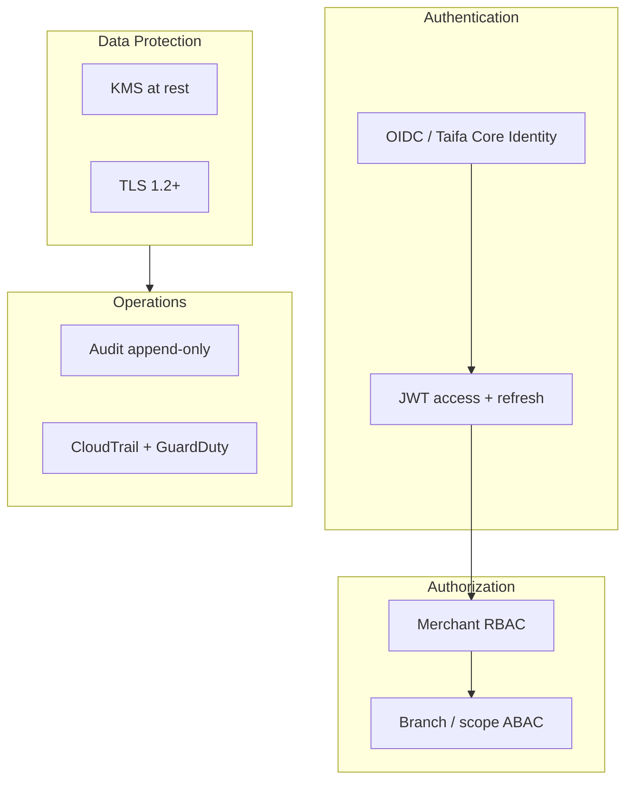

# 10 — Security Model

---

## Executive summary

Zero-trust security for Merchant Platform: OAuth2/OIDC, JWT, RBAC/ABAC, audit, encryption, KMS, secrets, device trust, sessions—**PCI DSS readiness** without card processing in Phase 1.

---

## Business purpose

Merchant PII and KYB documents are high-value targets; compromise undermines entire TNPI.

---

## Architecture

---

## OAuth2 / OIDC

| Flow | Use |
| --- | --- |
| Authorization code + PKCE | Merchant portal, mobile |
| Client credentials | Partner batch onboarding |
| Device code | Future kiosk |

Claims: `sub`, `merchant_id`, `roles[]`, `branch_ids[]`, `session_id`.

---

## RBAC + ABAC

- **RBAC:** role → permission catalog (versioned).
- **ABAC:** policies on `branch_id`, `merchant.status == active`, `device.status == active`.
- **Developers** cannot approve KYB or view full TIN without permission.

---

## Audit logging

All mutations → Core Audit + `merchant.audit` references; tamper-evident storage.

---

## Encryption & secrets

| Asset | Control |
| --- | --- |
| RDS | KMS CMK |
| S3 documents | SSE-KMS |
| API key secrets | bcrypt/argon hash; show once |
| Webhook secrets | rotated quarterly |

---

## PCI DSS readiness (Phase 1)

| Item | Phase 1 |
| --- | --- |
| Card data | **None** stored |
| Device certs | Prepare MPoC boundary doc for Phase 3 |
| Network segmentation | Merchant service outside CDE |
| ASV | On edge/API when in scope |

---

## Device trust

Attestation on activation; cert-bound device JWT for future SoftPOS; revocation list in Redis.

---

## Session management

Short-lived access tokens; refresh rotation; revoke on employee removal event.

---

## AWS architecture

[11_AWS_ARCHITECTURE.md](11_AWS_ARCHITECTURE.md)

---

## Implementation strategy

Threat model workshop MP-S0; penetration test before public pilot.

---

## Future expansion

HSM for device keys; hardware security module for high-volume chains.

---

## Cross-references

[10_SECURITY.md](../10_SECURITY.md) · [17_COMPLIANCE_GUIDE.md](../17_COMPLIANCE_GUIDE.md)
