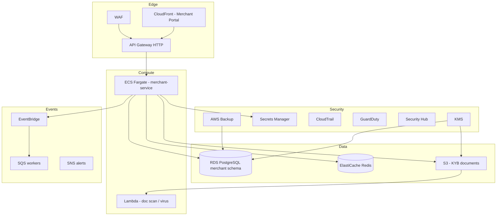
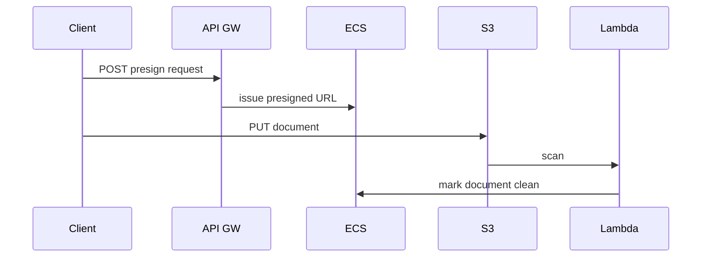

# 11 — AWS Architecture (Merchant Platform)

**Region:** `af-south-1` · Accounts: staging / prod per [SPRINT_0](../../platform/SPRINT_0_ENGINEERING_PLAN.md)

---

## Executive summary

Production deployment of Merchant Platform on AWS: API Gateway, ECS Fargate, Lambda (document scan), RDS PostgreSQL, Redis, S3, CloudFront (portal), IAM, KMS, Secrets Manager, observability, EventBridge, backup, and security services.

---

## Business purpose

Scalable, Well-Architected hosting for national merchant registry workloads.

---

## Architecture diagram

---

## Service sizing (initial)

| Component | Staging | Prod (pilot) |
| --- | --- | --- |
| ECS tasks | 2 × 0.5 vCPU | 3+ × 1 vCPU |
| RDS | db.t4g.medium | db.r6g.large Multi-AZ |
| Redis | cache.t4g.small | cache.r6g.large |

---

## IAM

- Task role: RDS, S3 prefix `merchant-docs/*`, Secrets Manager read, EventBridge publish.
- No task role access to payment orchestration resources in Phase 1.

---

## Sequence: document upload

---

## Domain model / API / events

Hosted by ECS — see sibling docs.

---

## Security considerations

Private subnets; VPC endpoints; WAF rate limits on `/merchants`.

---

## Implementation strategy

Terraform module `tnpi-merchant` (future) in `infra/`; deploy staging first.

---

## Future expansion

OpenSearch for merchant search; multi-region read replica for portal.

---

## Cross-references

[11_AWS_ARCHITECTURE.md](../11_AWS_ARCHITECTURE.md) (TNPI program)
