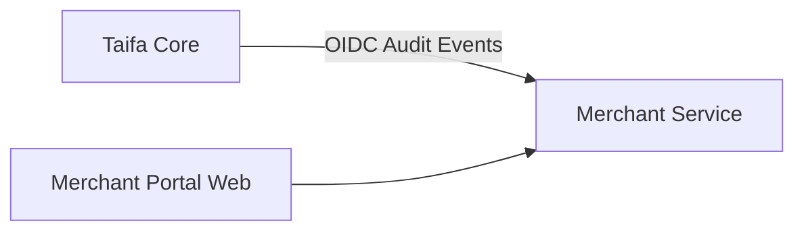
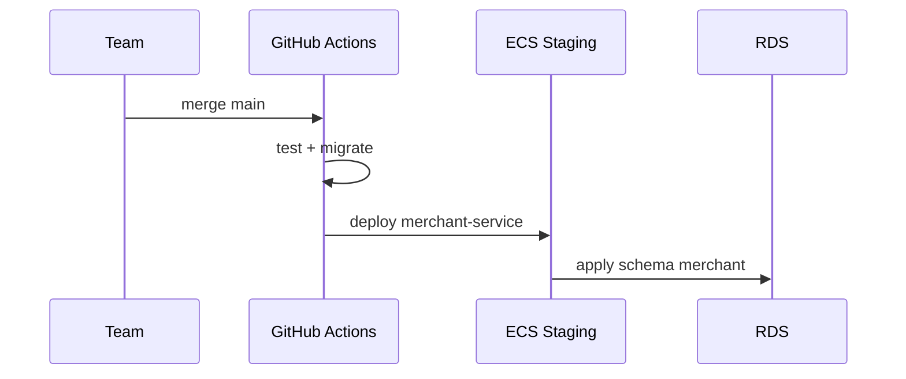

# 12 — Implementation Guide

---

## Executive summary

Step-by-step plan to implement Merchant Platform as TNPI Phase 1 **first production product**—on Taifa Core, without payment orchestration, wallet aggregation, SoftPOS pay, or QR pay.

---

## Business purpose

Align engineering squads, dependencies, and strangler migration from legacy Django modules.

---

## Architecture (delivery)

**Target code location (future):** `apps/backend/taifa_platform/merchant/` or dedicated `merchant-service` container.

---

## Strangler from legacy

| Legacy | Action |
| --- | --- |
| `enterprise/` merchant-like models | Read-only facade → new API |
| `payments/` merchant refs | Keep IDs; resolve via Merchant API |
| `acceptance/` terminals | Map to Device registry |

No deletion in Phase 1 implementation—parallel run with feature flag `tnpi.merchant.platform`.

---

## Implementation phases (engineering)

| Stage | Duration | Output |
| --- | --- | --- |
| MP-0 | 2 weeks | OpenAPI + migrations reviewed |
| MP-1 | 4 weeks | Merchant CRUD + onboarding FSM |
| MP-2 | 3 weeks | Branches + employees + RBAC |
| MP-3 | 3 weeks | Devices + settlement account metadata |
| MP-4 | 2 weeks | API keys + webhooks registry |
| MP-5 | 2 weeks | Portal MVP + ops review queue |
| MP-6 | 2 weeks | Hardening, load test, gate package |

---

## Sequence: first deploy to staging

---

## Domain model / API / events

Implement per [03](03_DOMAIN_MODEL.md), [07](07_API_SPECIFICATION.md), [08](08_EVENT_CATALOG.md).

---

## AWS architecture

[11_AWS_ARCHITECTURE.md](11_AWS_ARCHITECTURE.md)

---

## Security considerations

Gate each stage with threat model delta; SAST on PR.

---

## Implementation strategy

- Contract-first OpenAPI  
- Outbox for all events  
- Integration tests per aggregate  
- Ops runbook for KYB queue  

---

## Dependencies

| Dependency | Gate |
| --- | --- |
| Core S0 IaC staging | VPC + ECS |
| Core S1 Identity OIDC | JWT validation |
| Core S3 EventBridge | Event publish |
| KYB vendor / manual ops | Onboarding |

See [PHASE1_GATE_PACKAGE.md](PHASE1_GATE_PACKAGE.md) dependency graph.

---

## Future expansion

Split read models for search; merchant portal micro-frontend.

---

## Cross-references

[14_BACKLOG.md](14_BACKLOG.md) · [13_ROADMAP.md](13_ROADMAP.md)
