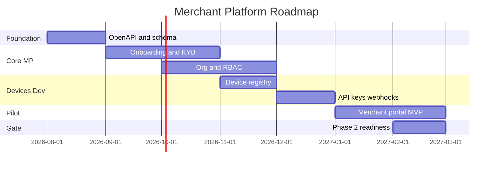

# 13 — Roadmap (Merchant Platform)

---

## Executive summary

12-month view of Merchant Platform capability rollout within TNPI Phase 1, aligned to national pilot and Phase 2 gate.

---

## Business purpose

Communicate sequencing to executives, regulators, and partners.

---

## Roadmap (mermaid)

---

## Milestones

| ID | Milestone | Date (target) |
| --- | --- | --- |
| MM-1 | First merchant `active` in staging | M+2 |
| MM-2 | 100-branch hierarchy test | M+4 |
| MM-3 | Device registry + cert pilot | M+5 |
| MM-4 | Public pilot (controlled merchants) | M+7 |
| MM-5 | Phase 2 gate approval | M+8 |

---

## Architecture / API / events / AWS

Delivered per milestone in [12_IMPLEMENTATION_GUIDE.md](12_IMPLEMENTATION_GUIDE.md).

---

## Security considerations

PCI readiness doc complete by MM-3; pen test by MM-4.

---

## Implementation strategy

Vertical slices per merchant segment pilot (e.g. fuel, hospitality).

---

## Future expansion

Self-service KYB for micro-merchants; partner bulk onboard API.

---

## Cross-references

[13_PAYMENT_ROADMAP.md](../13_PAYMENT_ROADMAP.md)
