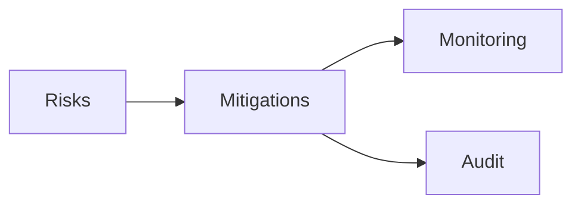

# 17 — Risk Register (Merchant Platform)

---

## Executive summary

Phase 1 merchant-specific risks and mitigations.

---

## Business purpose

Proactive governance before national merchant onboarding.

---

## Risk table

| ID | Risk | L | I | Pri | Mitigation | Owner |
| --- | --- | --- | --- | --- | --- | --- |
| MR-01 | Fake merchants onboarded | M | H | P1 | KYB + manual review tier | Compliance |
| MR-02 | PII breach via documents | L | H | P1 | KMS, presigned short TTL, access logs | Security |
| MR-03 | RBAC misconfiguration exposes KYB | M | H | P1 | Permission tests, code review | Engineering |
| MR-04 | Hierarchy performance at scale | M | M | P2 | Closure table/ltree, load tests MB-019 | Engineering |
| MR-05 | Legacy duplicate merchant records | M | M | P2 | Strangler + dedup rules on TIN | Architecture |
| MR-06 | Core Identity delay blocks MP | M | H | P2 | Parallel API mock; clear gate | Program |
| MR-07 | Device registry without cert authority | M | M | P2 | Partner CA decision by MP-4 | Security |
| MR-08 | Scope creep into payments | H | M | P1 | Architecture review gate; AC-A3 | Product |
| MR-09 | Ops queue overwhelmed at launch | M | M | P2 | Tiered KYB, automation v2 | Operations |
| MR-10 | Regulatory classification of Taifa | L | H | P2 | Legal opinion in compliance pack | Legal |

---

## Architecture

---

## API / events / AWS

Risks tracked per deployment in Security Hub findings workflow.

---

## Security considerations

Monthly risk review during MP-1–MP-6.

---

## Implementation strategy

Link Jira/Azure DevOps IDs to MR-xxx.

---

## Future expansion

Merge with [18_RISK_REGISTER.md](../18_RISK_REGISTER.md) quarterly.

---

## Cross-references

[PHASE1_GATE_PACKAGE.md](PHASE1_GATE_PACKAGE.md)
