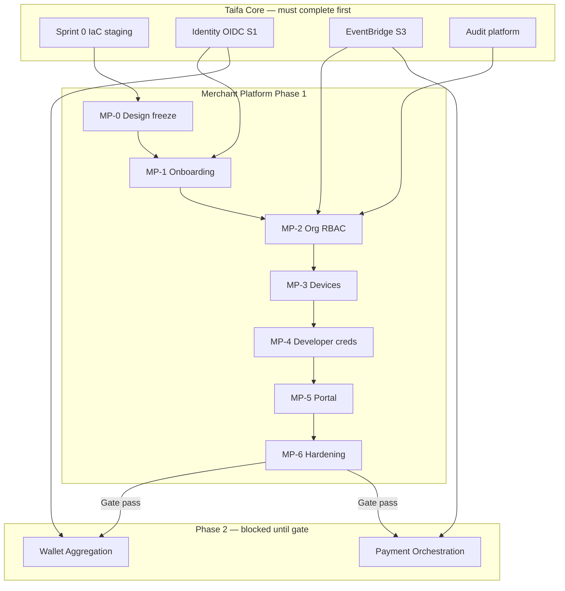

# TNPI Phase 1 — Gate Package (Merchant Platform)

**Document type:** Program gate — Product Readiness, Roadmap, Sprints, Dependencies, Phase 2 exit  
**Status:** Ready for review upon completion of implementation (this pack is **planning complete**)  
**Date:** 2026-08-06

---

## 1. Product Readiness Report

### Executive summary

The **Merchant Platform** documentation pack (`docs/payments/merchant/00–17`) is **complete for Phase 1 planning**. TNPI’s first production product is defined as the **trusted merchant identity layer**—registration through devices, workforce, settlement metadata, and developer credentials—**without** payment orchestration, wallet aggregation, SoftPOS transactions, or QR payments.

### Readiness dimensions

| Dimension | Status | Notes |
| --- | --- | --- |
| Product vision & capabilities | ✅ | [01](01_PRODUCT_VISION.md), [02](02_BUSINESS_CAPABILITIES.md) |
| Domain & data model | ✅ | [03](03_DOMAIN_MODEL.md), [09](09_DATABASE_MODEL.md) |
| Onboarding & KYB | ✅ | [04](04_MERCHANT_ONBOARDING.md) |
| Devices & employees | ✅ | [05](05_DEVICE_MANAGEMENT.md), [06](06_EMPLOYEE_MANAGEMENT.md) |
| APIs & events | ✅ | [07](07_API_SPECIFICATION.md), [08](08_EVENT_CATALOG.md) |
| Security & AWS | ✅ | [10](10_SECURITY_MODEL.md), [11](11_AWS_ARCHITECTURE.md) |
| Implementation plan | ✅ | [12](12_IMPLEMENTATION_GUIDE.md), [14](14_BACKLOG.md) |
| Acceptance & DoD | ✅ | [15](15_ACCEPTANCE_CRITERIA.md), [16](16_DEFINITION_OF_DONE.md) |
| Risks | ✅ | [17](17_RISK_REGISTER.md) |
| **Production code** | ⬜ | Not started — by design |
| **Taifa Core Identity (staging)** | ⬜ | Dependency — Core S1 |
| **AWS staging ECS for merchant** | ⬜ | Dependency — Core S0 |
| **Pilot merchants live** | ⬜ | Post-implementation |

### Product readiness verdict

| Question | Answer |
| --- | --- |
| Is architecture sufficient to start implementation? | **Yes** — Phase 1 Merchant Platform |
| Is production go-live ready? | **No** — implementation required |
| Can Phase 2 (Payment Sources) start now? | **No** — complete Phase 1 exit criteria §5 |

### Sign-off (implementation complete)

| Role | Name | Date |
| --- | --- | --- |
| TNPI Product Lead | | |
| Platform Engineering Lead | | |
| Security | | |
| Architecture Board | | |

---

## 2. Implementation Roadmap

High-level roadmap (detail: [13_ROADMAP.md](13_ROADMAP.md)):

| Quarter | Focus |
| --- | --- |
| **2026 Q3** | OpenAPI, schema, onboarding + KYB |
| **2026 Q4** | Branches, RBAC, devices, API keys |
| **2027 Q1** | Merchant portal MVP, pilot, gate to Phase 2 |

**Engineering stages:** MP-0 → MP-6 per [12_IMPLEMENTATION_GUIDE.md](12_IMPLEMENTATION_GUIDE.md).

---

## 3. Sprint Breakdown

| Sprint | Duration | Goals | Backlog IDs |
| --- | --- | --- | --- |
| **MP-0** | 2 wk | OpenAPI sign-off, RDS schema review, CI skeleton | — |
| **MP-1** | 4 wk | Registration, onboarding FSM, documents, KYB queue | MB-001–005, 003–004 |
| **MP-2** | 3 wk | Branches, employees, RBAC, audit, events | MB-006–008, 015–016 |
| **MP-3** | 3 wk | Settlement accounts, device lifecycle | MB-009–011 |
| **MP-4** | 2 wk | API keys, webhooks, search | MB-012–014 |
| **MP-5** | 2 wk | Merchant portal MVP | MB-017–018 |
| **MP-6** | 2 wk | Load test, security, gate evidence | MB-019–020 |

Full backlog: [14_BACKLOG.md](14_BACKLOG.md).

---

## 4. Dependency Graph

**External dependencies:** KYB legal policy; optional BRELA/TIN APIs; certificate authority partner for devices.

---

## 5. Exit Criteria — TNPI Phase 2 (Payment Sources Platform)

Phase 2 (**wallet aggregation + payment orchestration** — per [02_WALLET_AGGREGATION.md](../02_WALLET_AGGREGATION.md), [03_PAYMENT_ORCHESTRATION.md](../03_PAYMENT_ORCHESTRATION.md)) may begin when:

| # | Criterion |
| --- | --- |
| G1 | All [15_ACCEPTANCE_CRITERIA.md](15_ACCEPTANCE_CRITERIA.md) items **AC-F\*, AC-N\*, AC-S\*, AC-C\*, AC-A\*** passed in **staging** sign-off |
| G2 | This gate package **signed** (§1 table) |
| G3 | `merchant.status == active` path proven for ≥5 pilot merchants |
| G4 | `merchant_id` + `branch_id` + `device_id` stable IDs documented for orchestrator |
| G5 | Settlement account metadata available via API for active merchants |
| G6 | No P1 risks open in [17_RISK_REGISTER.md](17_RISK_REGISTER.md) without waiver ADR |
| G7 | Phase 2 ADR published: orchestrator reads merchant SoR only via API/events |
| G8 | **Explicit exclusion verified:** no payment charge, wallet link execution, SoftPOS tap-to-pay, or QR settlement in merchant service deployment |

---

## Merchant Dashboard (design summary)

Portal modules for Phase 1 (no live payment data):

| Module | Phase 1 |
| --- | --- |
| Profile & branding | ● |
| Branches & departments | ● |
| Devices | ● |
| Employees & roles | ● |
| Settlement accounts | ● |
| API keys & webhooks | ● |
| Notifications preferences | ● |
| Payments / settlements tabs | Placeholder → Phase 2 |
| Analytics | Onboarding funnel only |

---

## Cross-references

[00_INDEX.md](00_INDEX.md) · [00_PAYMENT_PROGRAM.md](../00_PAYMENT_PROGRAM.md)
