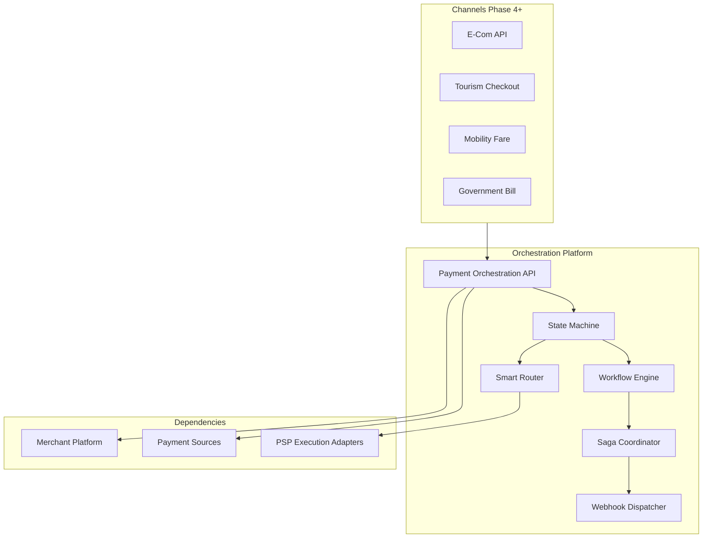
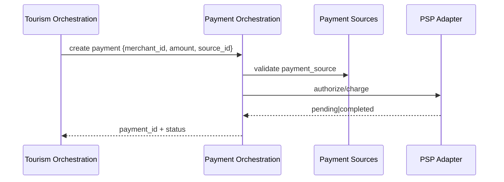

# 01 — Product Vision

---

## Executive summary

The **Payment Orchestration Platform** is TNPI Phase 3: enterprise-grade coordination of every Taifa payment—millions of transactions, multi-rail, multi-vertical—through one state machine, router, and saga layer.

---

## Business purpose

Vertical modules must not embed PSP logic. One orchestrator ensures consistency, auditability, and national scale.

---

## Architecture overview

---

## Product vision

**Every payment, one engine—reliable, observable, fair to every rail.**

---

## Vertical coverage (consumers)

Taifa Tourism · Mobility · Trade · Commerce · Government · Health · Education · future products—all call `POST /payments` with channel metadata.

---

## Sequence: tourism checkout

---

## API / events / database / AWS / security

See docs 07–12.

---

## Operational considerations

SLO: 99.95% orchestration API; p95 latency &lt; 500ms excluding PSP.

---

## Implementation strategy

Strangler from `apps/backend/payments/` router behind `tnpi.orchestration` flag.

---

## Future expansion

AI routing; real-time fraud ML; cross-border orchestration.

---

## Cross-references

[PHASE3_GATE_PACKAGE.md](PHASE3_GATE_PACKAGE.md)
