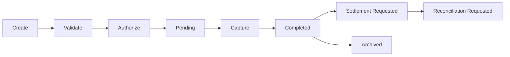
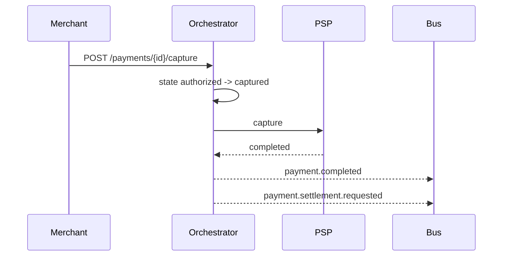

# 02 — Payment Lifecycle

---

## Executive summary

End-to-end **payment lifecycle** from creation through archival—validation, authorization, capture, completion, settlement/reconciliation **requests**, refunds, disputes—coordinated by orchestration, executed by external systems.

---

## Business purpose

Single lifecycle semantics for all channels and reports.

---

## Architecture overview

---

## Responsibilities (orchestrator)

| Capability | Owner |
| --- | --- |
| Authorization / capture / cancel | Orchestrator |
| Idempotency / duplicate detection | Orchestrator |
| Merchant & customer validation | Orchestrator (calls Merchant + Identity) |
| Payment source validation | Orchestrator (calls Payment Sources) |
| Balance verify | Orchestrator → PSP adapter (optional) |
| Risk checks | Orchestrator → fraud hook |
| Webhook / notification / receipt **trigger** | Orchestrator events |
| Settlement / recon **trigger** | Event only—[04_SETTLEMENT](../04_SETTLEMENT.md) consumes |
| Refund / reverse / dispute **initiation** | Orchestrator state + adapter call |
| Audit | Core Audit + `payment.*` events |

---

## Sequence: capture after auth

---

## State machine

Detailed states: [03_STATE_MACHINE.md](03_STATE_MACHINE.md).

---

## API / events / DB

[07](07_API_SPECIFICATION.md) · [08](08_EVENT_CATALOG.md) · [09](09_DATABASE_MODEL.md)

---

## AWS / security / observability

Step Functions for long-running pending; [11](11_AWS_ARCHITECTURE.md) · [12](12_OBSERVABILITY.md)

---

## Implementation strategy

Align with existing [PAYMENTS.md](../../PAYMENTS.md) `PaymentResult` sealed outcomes.

---

## Future expansion

Partial capture; multi-capture hospitality.

---

## Cross-references

[06_SAGA_ORCHESTRATION.md](06_SAGA_ORCHESTRATION.md)
