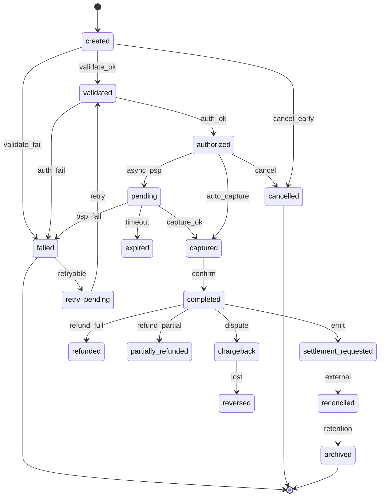
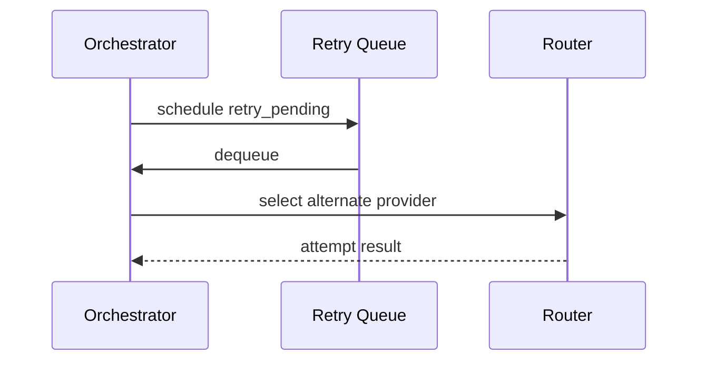

# 03 — State Machine

---

## Executive summary

**Canonical payment state machine** for all TNPI payments—including failure, retry, refund, and chargeback paths.

---

## Business purpose

Eliminate ambiguous payment status across modules.

---

## State diagram

---

## State definitions

| State | Description |
| --- | --- |
| `created` | Intent persisted, not validated |
| `validated` | Merchant, customer, source, amount OK |
| `authorized` | PSP hold or MM push accepted |
| `pending` | Awaiting PSP callback |
| `captured` | Funds instruction sent |
| `completed` | Terminal success for commerce |
| `settlement_requested` | Event to settlement service |
| `reconciled` | Matched by recon service (external) |
| `archived` | Cold storage policy |
| `failed` | Terminal failure |
| `cancelled` | Void before completion |
| `expired` | TTL exceeded |
| `refunded` / `partially_refunded` | Money return initiated |
| `reversed` | Chargeback lost |
| `chargeback` | Dispute open |
| `retry_pending` | Scheduled retry |
| `timed_out` | Alias mapped to `expired` in API |

---

## Transitions rules

- Only orchestrator service may transition state (SoR).
- Illegal transitions return `409 conflict`.
- All transitions emit `payment.*` event + audit.

---

## Sequence: retry path

---

## API mapping

`GET /payments/{id}` returns `status` enum matching machine.

---

## Events

`payment.retry`, `payment.timeout`, etc. — [08_EVENT_CATALOG.md](08_EVENT_CATALOG.md)

---

## Database

`payment.status`, `payment_attempt.status` — [09_DATABASE_MODEL.md](09_DATABASE_MODEL.md)

---

## Security / AWS / implementation

Immutable state history table; Step Functions sync with DB.

---

## Future expansion

`partial_success` for split payments.

---

## Cross-references

[02_PAYMENT_LIFECYCLE.md](02_PAYMENT_LIFECYCLE.md)
