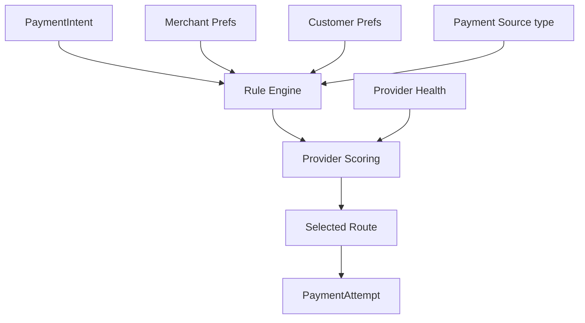
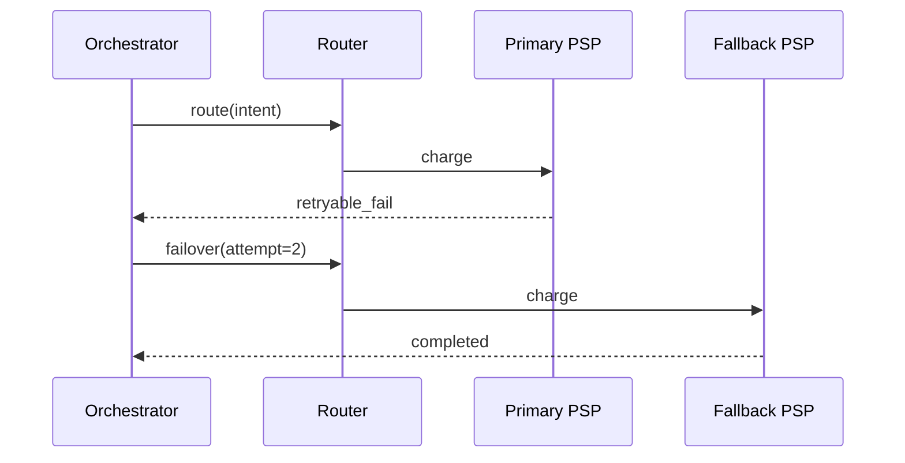

# 04 — Smart Routing Engine

---

## Executive summary

**Intelligent routing** selects PSP execution path per payment using rules, preferences, health, cost, latency, and failover—without embedding business rules in verticals.

---

## Business purpose

Maximize success rate and control cost across fragmented East African rails.

---

## Architecture overview

---

## Inputs

| Input | Source |
| --- | --- |
| `payment_source_id` | Payment Sources |
| `merchant_id`, MCC | Merchant Platform |
| `amount`, `currency` | Intent |
| `channel` | tourism, mobility, softpos, qr, api |
| Provider health | Health monitor |
| Priority / failover config | Merchant + customer preferences |

---

## Routing algorithm (v1)

1. Filter providers supporting `source.type` + currency + amount limits.  
2. Remove `unavailable` from health service.  
3. Apply merchant mandatory rail if configured.  
4. Score remaining: success rate (7d), latency p95, fee schedule.  
5. Select primary; queue alternates for failover.

---

## Sequence: failover

---

## State machine / API / events

Route recorded on `PaymentAttempt`; event `payment.retry` on failover.

---

## Database

`provider_route`, `routing_rule` — [09_DATABASE_MODEL.md](09_DATABASE_MODEL.md)

---

## AWS

Rules in RDS + Redis cache; optional Lambda for score refresh.

---

## Security

No PAN in routing layer; route decisions audited.

---

## Operational considerations

Dashboard: route distribution, failover rate.

---

## Implementation strategy

Start with static rules; add metrics-driven scoring in v2.

---

## Future expansion

ML routing; regional routing (Dar vs Arusha).

---

## Cross-references

[payment-sources Provider Health](../payment-sources/06_PROVIDER_ADAPTERS.md)
