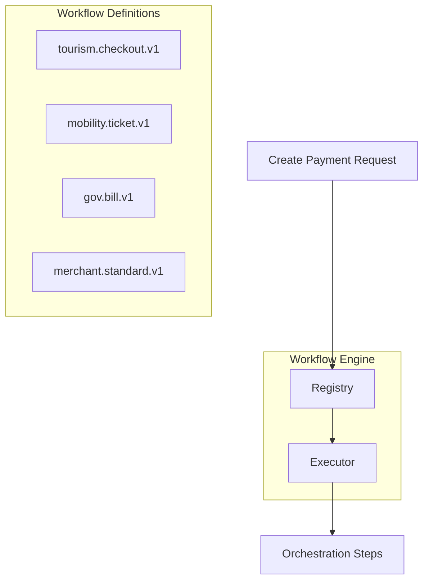
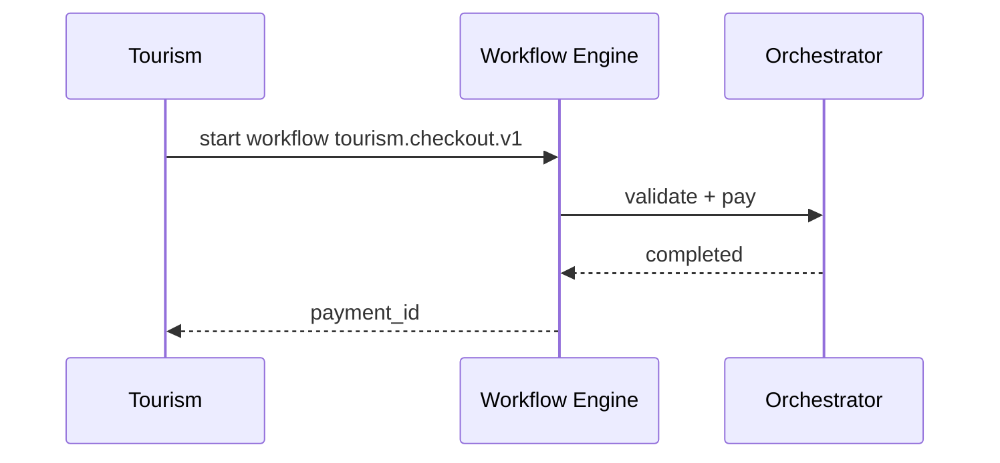

# 05 — Workflow Engine

---

## Executive summary

**Configurable, event-driven workflows** per channel: tourism booking, mobility ticket, government bill, merchant checkout, hotel, insurance, marketplace—each a workflow definition invoking orchestration steps.

---

## Business purpose

Reuse one engine; vary steps by vertical without forking core payment code.

---

## Architecture overview

---

## Example: tourism booking checkout

| Step | Action |
| --- | --- |
| 1 | Validate merchant + tourism metadata |
| 2 | Validate payment source |
| 3 | Risk score |
| 4 | Authorize/capture per policy |
| 5 | Emit `payment.completed` + notify tourism saga |

---

## Sequence

---

## Configuration

Stored as versioned JSON/YAML in Configuration platform; feature flags per workflow.

---

## State machine / saga

Long workflows delegate to [06_SAGA_ORCHESTRATION.md](06_SAGA_ORCHESTRATION.md).

---

## API

`POST /payments` includes `workflow_id` optional; default `merchant.standard.v1`.

---

## Events

Workflow-level: `payment.workflow.started`, `payment.workflow.completed`

---

## AWS

Step Functions express workflows; ECS for synchronous fast path.

---

## Security / observability

Workflow runs scoped to `merchant_id` + module claims.

---

## Implementation strategy

Ship 3 workflows: standard, mobility, tourism stub.

---

## Future expansion

Visual workflow designer for partners.

---

## Cross-references

[tourism orchestration](../../tourism/02_TRAVEL_ORCHESTRATION_DOMAIN.md)
