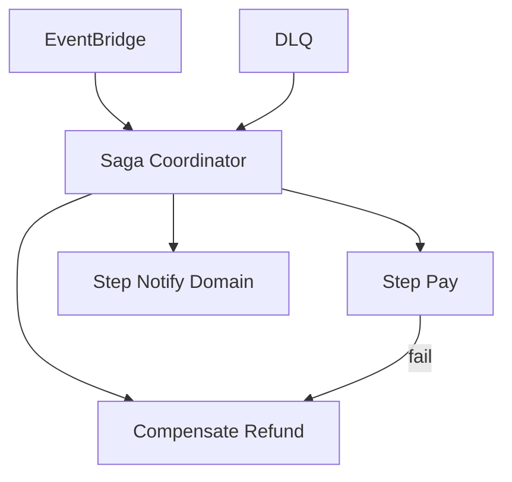
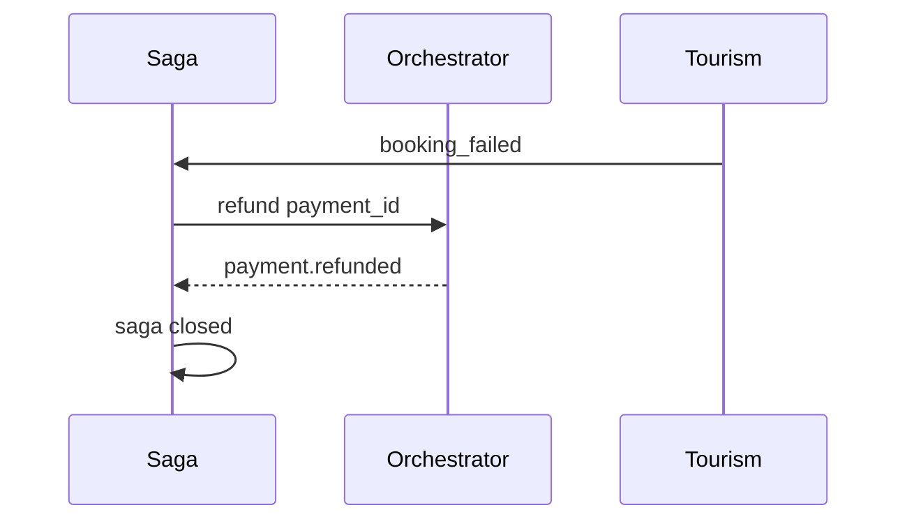

# 06 — Saga Orchestration

---

## Executive summary

**Distributed sagas** for multi-step payments: coordinator, compensation, rollback, timeouts, retries, DLQ, idempotency, and practical exactly-once via outbox + idempotent consumers.

---

## Business purpose

Tourism checkout + inventory + payment requires coordinated failure handling.

---

## Architecture overview

---

## Patterns

| Pattern | Use |
| --- | --- |
| Choreography | Simple `payment.completed` consumers |
| Orchestration | Step Functions + coordinator for tourism |
| Compensation | `refund` saga on booking failure |
| Outbox | DB commit + event atomic |
| Idempotency key | Client + PSP |

---

## Sequence: compensate on booking fail

---

## Failure recovery

| Mechanism | Description |
| --- | --- |
| Retry queue | Exponential backoff, max attempts |
| DLQ | Manual replay after fix |
| Event replay | From archive with idempotent handlers |
| Timeout | Saga TTL → compensate |

---

## State machine

Saga instance: `running`, `completed`, `compensating`, `failed`

---

## API / events / DB

`saga_instance` table; events `payment.*`

---

## AWS

Step Functions standard workflows; SQS DLQ; EventBridge replay bus.

---

## Security

Saga admin APIs internal only.

---

## Operational considerations

Runbook: stuck saga; metrics on compensation rate.

---

## Implementation strategy

Exactly-once: **at-least-once delivery + idempotent consumers** (practical standard).

---

## Future expansion

Temporal-style long-running sagas if volume demands.

---

## Cross-references

[architecture/01_DOMAIN_GOVERNANCE.md](../../architecture/01_DOMAIN_GOVERNANCE.md)
