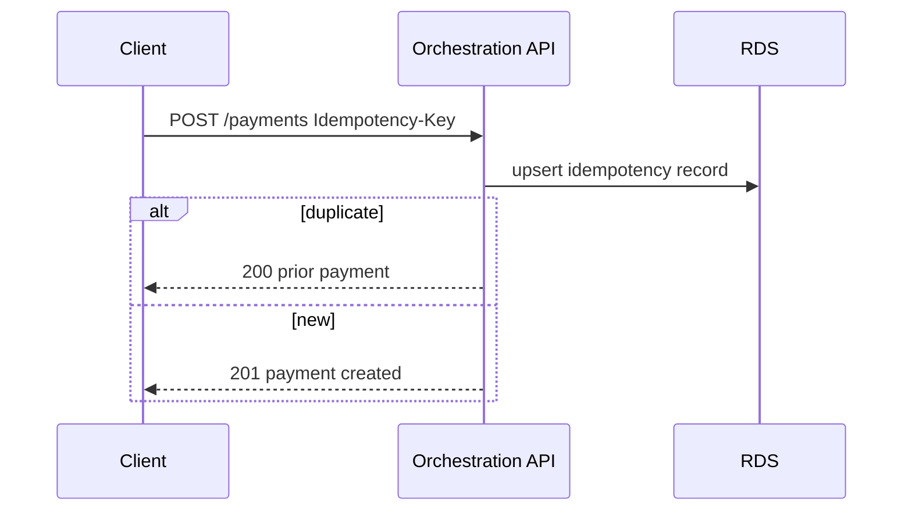

# 07 — API Specification

**Base:** `/api/v1/payments` · **Auth:** OAuth2 JWT (merchant, customer, service)

---

## Executive summary

Orchestration REST API: create, authorize, capture, cancel, refund, reverse, status, history, retry, webhooks management, health.

---

## Business purpose

Single integration surface for all Taifa payments.

---

## Core payments

| Method | Path | Description |
| --- | --- | --- |
| POST | `/payments` | Create (+ optional auto auth) |
| GET | `/payments/{id}` | Status |
| GET | `/payments` | List (merchant or customer scoped) |
| POST | `/payments/{id}/authorize` | Authorize |
| POST | `/payments/{id}/capture` | Capture |
| POST | `/payments/{id}/cancel` | Cancel |
| POST | `/payments/{id}/refund` | Refund |
| POST | `/payments/{id}/reverse` | Reverse |
| POST | `/payments/{id}/retry` | Manual/system retry |
| GET | `/payments/{id}/attempts` | Attempt history |

**Create body (illustrative):**

```json
{
  "amount": { "currency": "TZS", "minor_units": 100000 },
  "merchant_id": "uuid",
  "payment_source_id": "uuid",
  "idempotency_key": "uuid",
  "channel": "tourism|mobility|api|gov",
  "workflow_id": "tourism.checkout.v1",
  "metadata": { "booking_id": "uuid" }
}
```

---

## Scoped lists

| Method | Path |
| --- | --- |
| GET | `/merchants/{merchant_id}/payments` |
| GET | `/customers/me/payments` |

---

## Webhooks (orchestration dispatch)

| Method | Path |
| --- | --- |
| GET | `/payments/webhooks/deliveries` | Ops |
| POST | `/payments/{id}/webhooks/redrive` | Ops |

Merchant endpoint registration remains [Merchant Platform](../merchant/07_API_SPECIFICATION.md).

---

## Provider / health

| Method | Path |
| --- | --- |
| GET | `/payments/health` | Liveness |
| GET | `/payments/ready` | Dependencies ready |
| GET | `/payments/providers/status` | Aggregated rail health |

---

## Sequence: create with idempotency



---

## Events / DB / AWS / security

[08](08_EVENT_CATALOG.md) · [09](09_DATABASE_MODEL.md) · [10](10_SECURITY_MODEL.md)

---

## Operational considerations

Rate limits per merchant tier; 429 with `Retry-After`.

---

## Implementation strategy

OpenAPI `tnpi-orchestration-v1`; backward compat alias `capture_merchant_payment`.

---

## Future expansion

Batch payments; payment links orchestration (Phase 4).

---

## Cross-references

[14_API_CATALOG.md](../14_API_CATALOG.md)
