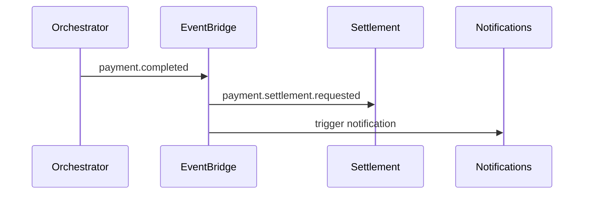

# 08 — Event Catalog

**Prefix:** `payment.*` · Envelope: [event-envelope-v1.json](../../platform/schemas/event-envelope-v1.json)

---

## Executive summary

Canonical orchestration events for lifecycle, side-effects (requested), and integrations.

---

## Business purpose

Event-first integration for verticals, settlement, recon, receipts, notifications.

---

## Lifecycle events

| event_type | When |
| --- | --- |
| `payment.created` | Intent persisted |
| `payment.validated` | Validation passed |
| `payment.authorized` | PSP auth OK |
| `payment.pending` | Async wait |
| `payment.completed` | Success terminal |
| `payment.failed` | Failure terminal |
| `payment.cancelled` | Cancelled |
| `payment.refunded` | Refund issued |
| `payment.reversed` | Reversal/chargeback lost |
| `payment.timeout` | Expired |
| `payment.retry` | Failover/retry scheduled |

---

## Side-effect requests (orchestrator emits; other services implement)

| event_type | Consumer |
| --- | --- |
| `payment.settlement.requested` | Settlement service |
| `payment.reconciliation.requested` | Reconciliation service |
| `payment.receipt.generated` | Receipt service (or trigger) |
| `payment.notification.sent` | Notification platform |
| `payment.dispute.opened` | Disputes (future) |

---

## Example payload

```json
{
  "event_type": "payment.completed",
  "correlation_id": "uuid",
  "payload": {
    "payment_id": "uuid",
    "merchant_id": "uuid",
    "amount": { "currency": "TZS", "minor_units": 50000 },
    "provider_id": "mpesa_tz",
    "channel": "mobility"
  }
}
```

---

## Sequence: completion fan-out



---

## State machine / API / DB / AWS

Outbox pattern mandatory.

---

## Security

No sensitive auth data in events.

---

## Operational considerations

DLQ per consumer; replay tooling.

---

## Implementation strategy

Align [ADR-0002](../../architecture/adr/0002-event-catalog-prefix-policy.md).

---

## Future expansion

`payment.split.completed` for marketplaces.

---

## Cross-references

[15_EVENT_CATALOG.md](../15_EVENT_CATALOG.md)
