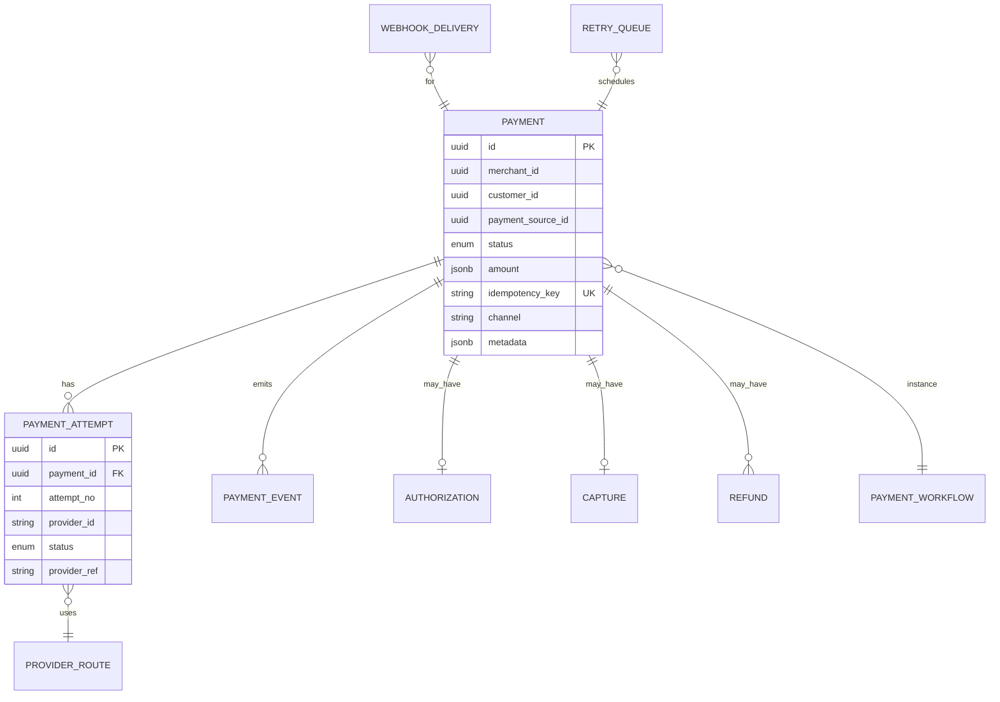

# 09 — Database Model

**Schema:** `orchestration` (PostgreSQL)

---

## Executive summary

SoR tables for payments, attempts, routes, workflows, authorizations, captures, refunds, events, webhooks, retries.

---

## Business purpose

Durable orchestration state at scale.

---

## ER diagram

---

## Key tables

| Table | Purpose |
| --- | --- |
| `payment` | Aggregate root |
| `payment_attempt` | Per-PSP try |
| `provider_route` | Decision audit |
| `payment_workflow` | Workflow instance |
| `authorization` / `capture` / `refund` | Stage records |
| `payment_event` | Local event log (optional) |
| `webhook_delivery` | Outbound status |
| `retry_queue` | Scheduled retries |
| `idempotency_key` | Dedup store |

---

## Indexes

`(merchant_id, created_at)`, `(idempotency_key)`, `(status, updated_at)` for sweeper.

---

## State machine / API / events

Status column matches [03_STATE_MACHINE.md](03_STATE_MACHINE.md).

---

## AWS

RDS Multi-AZ; partition archive by month.

---

## Security

Row-level `merchant_id` for tenant queries.

---

## Operational considerations

Retention: hot 13 months, archive S3.

---

## Implementation strategy

Ledger postings remain acceptance accounting—reference `payment_id` only.

---

## Future expansion

Read replica for history API.

---

## Cross-references

[PAYMENTS.md](../../PAYMENTS.md)
