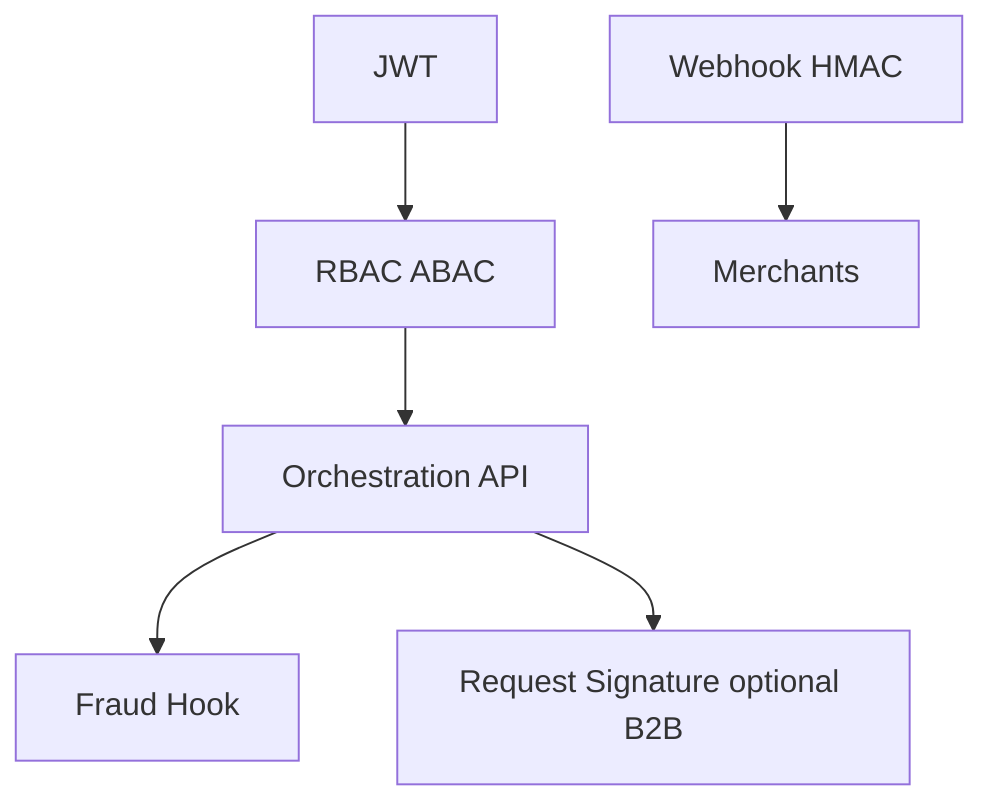

# 10 — Security Model

---

## Executive summary

OAuth2/OIDC, JWT, RBAC/ABAC, PCI scope minimization, KMS, secrets, request/webhook signing, fraud hooks, integrity, audit.

---

## Business purpose

National payment brain is critical infrastructure.

---

## Architecture

---

## Controls

| Control | Detail |
| --- | --- |
| AuthN | Taifa Core OIDC |
| AuthZ | Merchant staff vs customer vs service accounts |
| ABAC | `merchant_id`, amount limits, channel |
| Idempotency | Required on POST /payments |
| Webhook signing | HMAC-SHA256 `Taifa-Signature` |
| PCI | No PAN in orchestrator DB |
| Fraud | Pre-auth hook; block or step-up |
| Audit | 100% state transitions |

---

## API / events / AWS

Secrets in SM; mTLS for tier-1 partners.

---

## Operational considerations

Security incident runbook; key rotation quarterly.

---

## Implementation strategy

Threat model ORCH-001 before prod.

---

## Future expansion

PSD2 SCA patterns for cards.

---

## Cross-references

[10_SECURITY.md](../10_SECURITY.md)
