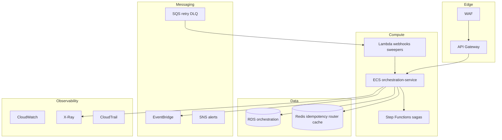
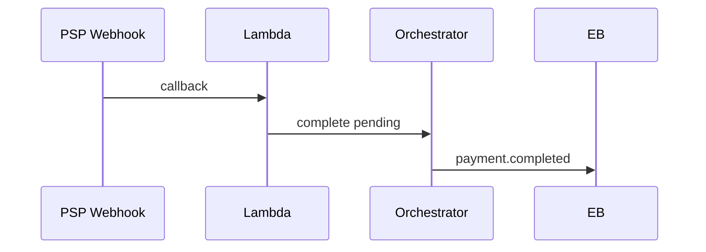

# 11 — AWS Architecture

---

## Executive summary

Production orchestration on API Gateway, ECS Fargate, Step Functions, Lambda, RDS, Redis, EventBridge, SQS/SNS, X-Ray, security & backup services.

---

## Business purpose

Scale to millions of tx/month with HA and observability.

---

## Component diagram

---

## Sequence: async pending payment

---

## Sizing (pilot prod)

| Resource | Initial |
| --- | --- |
| ECS | 6 tasks × 1 vCPU |
| RDS | db.r6g.xlarge Multi-AZ |
| Redis | cluster mode enabled at scale |

---

## Security / observability

[10](10_SECURITY_MODEL.md) · [12](12_OBSERVABILITY.md)

---

## Operational considerations

Multi-AZ; autoscale on CPU and queue depth.

---

## Implementation strategy

IaC module `tnpi-orchestration`.

---

## Future expansion

Multi-region active-passive.

---

## Cross-references

[11_AWS_ARCHITECTURE.md](../11_AWS_ARCHITECTURE.md)
