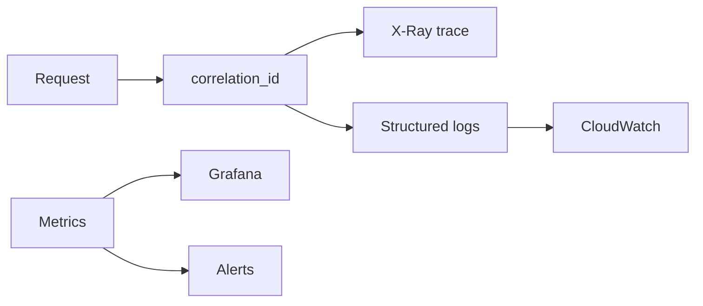

# 12 — Observability

---

## Executive summary

Distributed tracing, correlation IDs, metrics, alerts, dashboards, transaction/latency/failure monitoring for orchestration.

---

## Business purpose

Operate national payment brain with SRE practices.

---

## Architecture

---

## Correlation ID

- Client sends `X-Correlation-Id` or server generates.
- Propagate to PSP adapters, EventBridge, webhooks.
- Log field mandatory on every line.

---

## Metrics (key)

| Metric | Type |
| --- | --- |
| `payments.created` | counter |
| `payments.completed` | counter |
| `payments.failed` | counter by reason |
| `payment.latency_ms` | histogram |
| `router.failover` | counter |
| `retry.queue.depth` | gauge |
| `webhook.delivery.fail` | counter |

---

## Dashboards

| Dashboard | Audience |
| --- | --- |
| Orchestration overview | SRE |
| Merchant success rate | Product |
| Provider health overlay | Ops |
| Saga compensation | Engineering |

---

## Alerts

| Alert | Threshold |
| --- | --- |
| Error rate | &gt; 1% 5m |
| p95 latency | &gt; 2s |
| DLQ depth | &gt; 100 |
| Pending stale | &gt; 15m count |

---

## State machine / API / AWS

X-Ray groups per service; CloudWatch Logs Insights saved queries.

---

## Security

No PII in metric labels.

---

## Operational considerations

Weekly failure review; SLO 99.95%.

---

## Implementation strategy

OpenTelemetry SDK alignment with Core monitoring platform.

---

## Future expansion

Anomaly detection on failure rate.

---

## Cross-references

[10_MONITORING_PLATFORM.md](../../platform/10_MONITORING_PLATFORM.md)
