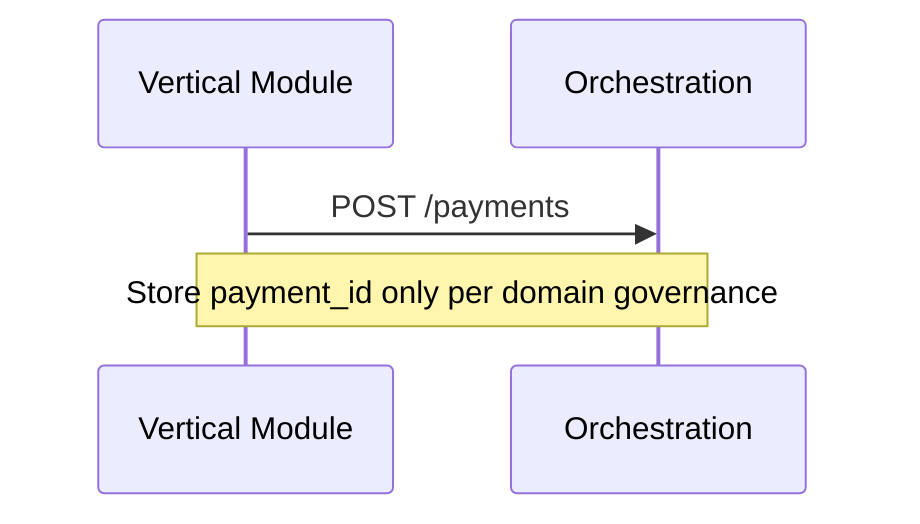

# 13 — Implementation Guide

---

## Executive summary

Phase 3 implementation: orchestration service, state machine, router, workflows, sagas, webhooks—on top of Merchant + Payment Sources + PSP **execution** adapters (not rebuilding link adapters).

---

## Business purpose

Ordered delivery minimizing risk to live Taifa modules.

---

## Architecture

Strangler: `payments/` Django → `tnpi-orchestration` ECS; facade preserves APIs during migration.

---

## Stages

| Stage | Weeks | Deliverable |
| --- | --- | --- |
| OR-0 | 2 | OpenAPI, schema, state machine code spec |
| OR-1 | 4 | Create payment + idempotency + validate |
| OR-2 | 4 | Authorize/capture/cancel + M-Pesa exec path |
| OR-3 | 3 | Router + failover + retry queue |
| OR-4 | 3 | Events outbox + webhooks |
| OR-5 | 3 | Workflows (standard, mobility, tourism) |
| OR-6 | 3 | Sagas + Step Functions |
| OR-7 | 2 | Observability + load test |
| OR-8 | 2 | Gate + production readiness |

---

## Sequence: vertical integration

---

## Dependencies

Merchant API, Payment Sources API, Core Identity/Events, PSP sandbox.

---

## Security / observability

Per docs 10, 12.

---

## Operational considerations

Blue/green ECS deploy; forward-only migrations.

---

## Implementation strategy

Feature flag `tnpi.orchestration`; shadow mode compare legacy router.

---

## Future expansion

Full cutover from legacy `PaymentRouter`.

---

## Cross-references

[15_BACKLOG.md](15_BACKLOG.md) · [PHASE3_GATE_PACKAGE.md](PHASE3_GATE_PACKAGE.md)
