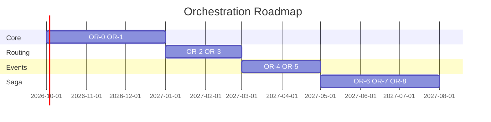

# 14 — Roadmap

---

## Executive summary

Phase 3 orchestration roadmap 2026 Q4 – 2027 Q3.

---

## Business purpose

Program planning.

---

## Gantt

---

## Milestones

| ID | Outcome |
| --- | --- |
| OR-M1 | First sandbox payment completed |
| OR-M2 | Failover proven |
| OR-M3 | Tourism workflow live staging |
| OR-M4 | 1k TPS load test |
| OR-M5 | Phase 4 gate |

---

## Architecture through future expansion

Phase 4 acceptance channels consume orchestration only.

---

## Cross-references

[13_PAYMENT_ROADMAP.md](../13_PAYMENT_ROADMAP.md)
