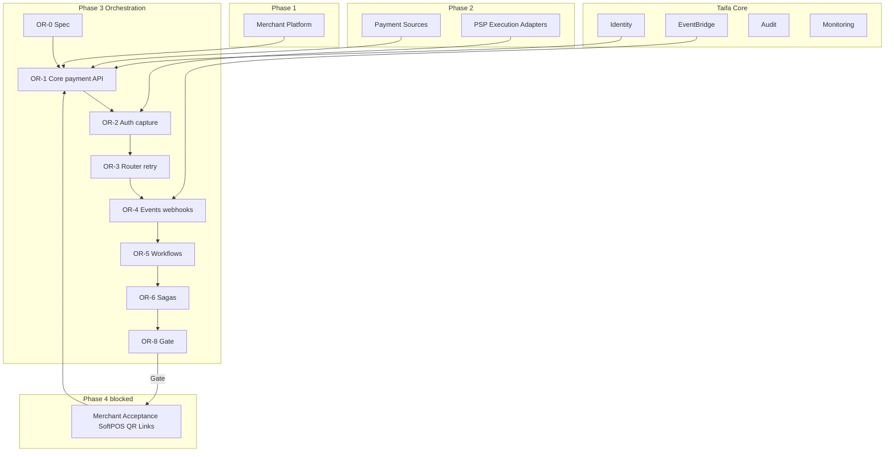

# TNPI Phase 3 — Gate Package (Payment Orchestration Platform)

**Status:** Architecture planning complete — implementation authorized upon Phase 2 gate (assumed **approved**)  
**Date:** 2026-08-06

---

## 1. Product Readiness Report

### Executive summary

The **Payment Orchestration Platform** pack (`docs/payments/orchestration/00–18`) defines TNPI Phase 3: the **central payment brain**—lifecycle state machine, smart routing, workflows, sagas, APIs, events, observability—without implementing settlement/reconciliation engines, SoftPOS, QR channels, or PSP link-layer (Phase 2).

### Readiness matrix

| Dimension | Status |
| --- | --- |
| Product vision & lifecycle | ✅ |
| State machine & routing | ✅ |
| Workflows & sagas | ✅ |
| APIs & events | ✅ |
| Data, security, AWS, observability | ✅ |
| Implementation guide, backlog, acceptance, risks | ✅ |
| **Production code** | ⬜ |
| **E2E sandbox payment** | ⬜ |
| **Phase 2 Payment Sources gate** | ✅ assumed |
| **Phase 1 Merchant gate** | ✅ assumed |

### Verdict

| Question | Answer |
| --- | --- |
| Start Phase 3 **implementation** (architecture)? | **Yes** |
| Production national traffic? | **No** — after §6 assessment |
| Start Phase 4 acceptance channels? | **No** — §4 exit criteria |

### Sign-off (post-implementation)

| Role | Date |
| --- | --- |
| TNPI Product Lead | |
| Principal Architect | |
| Security | |
| SRE | |

---

## 2. Dependency Graph

**Rules:** Orchestrator **never** stores PSP passwords; reads `payment_source_id` only; validates `merchant_id` via Merchant API.

---

## 3. Sprint Breakdown

| Sprint | Duration | Focus | Backlog |
| --- | --- | --- | --- |
| **OR-0** | 2 wk | State machine spec, OpenAPI, schema | — |
| **OR-1** | 4 wk | Create, validate, idempotency | ORB-001–005 |
| **OR-2** | 4 wk | Auth/capture/cancel, M-Pesa exec | ORB-006–008 |
| **OR-3** | 3 wk | Router, failover, retry, fraud stub | ORB-009–010, 018 |
| **OR-4** | 3 wk | Events, webhooks, refund, settlement trigger | ORB-011–013, 019 |
| **OR-5** | 3 wk | Workflows standard/mobility/tourism | ORB-014–016 |
| **OR-6** | 3 wk | Step Functions sagas | ORB-017 |
| **OR-7** | 2 wk | Observability, load, shadow legacy | ORB-020–022 |
| **OR-8** | 2 wk | Gate evidence, prod readiness review | ORB-023 |

Detail: [13_IMPLEMENTATION_GUIDE.md](13_IMPLEMENTATION_GUIDE.md) · [15_BACKLOG.md](15_BACKLOG.md)

---

## 4. Exit Criteria — Phase 4 (Merchant Acceptance Platform)

Phase 4 per [06_SOFTPOS.md](../06_SOFTPOS.md), [07_QR_PAYMENTS.md](../07_QR_PAYMENTS.md), payment links, in-app APIs may start when:

| # | Criterion |
| --- | --- |
| E1 | [16_ACCEPTANCE_CRITERIA.md](16_ACCEPTANCE_CRITERIA.md) AC-F/N/S met in **staging** |
| E2 | Phase 3 gate package signed (§1) |
| E3 | Orchestration API stable (`tnpi-orchestration-v1` frozen) |
| E4 | ≥1 **completed** payment per channel metadata type: `api`, `mobility`, `tourism` in staging |
| E5 | Webhook delivery SLO met (95% &lt; 60s) |
| E6 | Idempotency chaos test passed |
| E7 | Vertical modules store only `payment_id` (domain governance audit) |
| E8 | **No** SoftPOS/QR **channel** services in prod—only orchestration ready |
| E9 | Settlement/reconciliation **services** may be parallel track—they consume events but are not required for Phase 4 **acceptance UI** pilot |
| E10 | Architecture Board approves Phase 4 scope (certification plan for SoftPOS) |

---

## 5. Architecture Review Report

### Scope reviewed

Payment Orchestration Platform documentation vs Taifa Constitution, Domain Governance, TNPI Phases 1–2, legacy `PAYMENTS.md`, tourism/mobility integration rules.

### Findings

| ID | Finding | Severity | Recommendation |
| --- | --- | --- | --- |
| AR-01 | Single orchestration SoR aligns with constitution “one money orchestration path” | ✅ Positive | Enforce lint: no direct PSP calls from verticals |
| AR-02 | Settlement/recon as **events** avoids scope creep in Phase 3 | ✅ Positive | Document consumer ownership in [04_SETTLEMENT](../04_SETTLEMENT.md) |
| AR-03 | Legacy `PaymentRouter` parallel run required | Medium | ORB-022 shadow mode |
| AR-04 | `payment_source_id` contract from Phase 2 must be frozen | Medium | Version API before OR-2 |
| AR-05 | Tourism/commerce boundary (pay vs booking) | Medium | Workflows call orchestrator; booking SoR unchanged |
| AR-06 | ADR-0001 ledger postings timing | Low | Posting on `payment.completed` only—ADR update |

### Architecture decision records (proposed)

| ADR | Topic |
| --- | --- |
| ADR-TNPI-ORCH-001 | Orchestration as mandatory path for all Taifa charges |
| ADR-TNPI-ORCH-002 | Step Functions for sagas &gt; 3 steps |
| ADR-TNPI-ORCH-003 | At-least-once events + idempotent consumers |

### Review verdict

**Approved to proceed with Phase 3 implementation** subject to Phase 2 exit evidence and ADR-TNPI-ORCH-001 publication.

**Reviewers:** Enterprise Architecture (chair) · TNPI · Security · SRE — signatures in §1.

---

## 6. Production Readiness Assessment

### Scale & reliability

| Area | Target | Phase 3 staging | Production |
| --- | --- | --- | --- |
| API availability | 99.95% | Required OR-7 | Before national pilot |
| Throughput | 1k TPS orchestration | Load test OR-7 | Scale ECS + RDS |
| RPO/RTO | 5 min / 1 hr | DR drill | AWS Backup + runbook |
| Multi-AZ | Yes | Staging | Prod |

### Security & compliance

| Item | Status |
| --- | --- |
| Threat model ORCH-001 | Required pre-prod |
| Penetration test | Required pre-pilot |
| PCI orchestrator out of PAN scope | ✅ by design |
| BoT PSP partnership for live money | External gate |

### Observability

| Item | Required |
| --- | --- |
| Dashboards ORB-020 | Yes |
| Paging on error rate / DLQ | Yes |
| X-Ray service map | Yes |

### Operational maturity

| Item | Status |
| --- | --- |
| Runbook: stuck pending, replay DLQ | Required OR-8 |
| On-call rotation | Before prod pilot |
| Feature flags rollback | `tnpi.orchestration` |

### Production readiness verdict

| Stage | Assessment |
| --- | --- |
| **Architecture (now)** | **Ready** |
| **Staging pilot** | Ready after OR-1–OR-4 |
| **National production** | **Not ready** until §6 security/load/ops items complete + regulatory sign-off |

---

## Cross-references

[00_INDEX.md](00_INDEX.md) · [payment-sources/PHASE2_GATE_PACKAGE.md](../payment-sources/PHASE2_GATE_PACKAGE.md)
