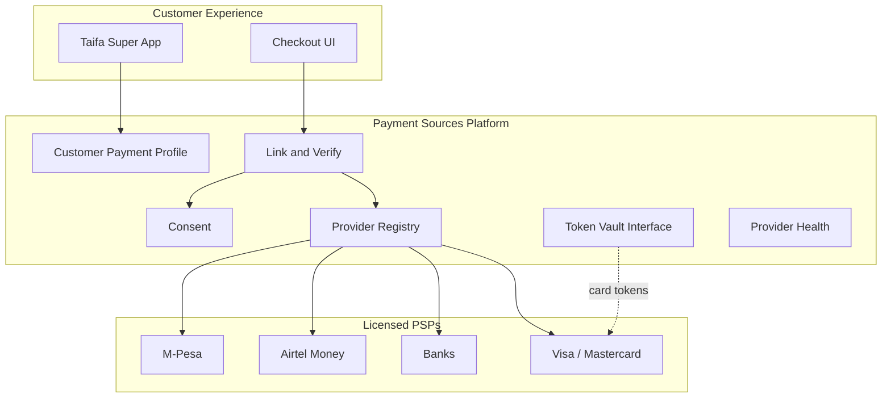
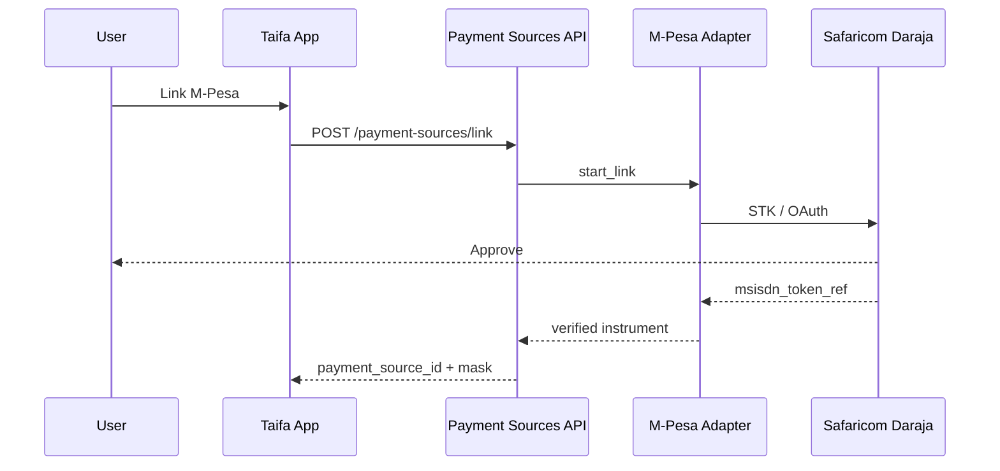

# 01 — Product Vision (Payment Sources)

---

## Executive summary

The **Payment Sources Platform** is TNPI Phase 2: the national layer where citizens and businesses **connect** M-Pesa, Airtel Money, Mixx, HaloPesa, banks, cards, and future rails—via consent, tokens, and provider adapters—so checkout can offer one unified wallet experience **without Taifa issuing money**.

---

## Business purpose

Fragmented rails block digital adoption. A single, trusted **instrument registry** enables Phase 3 orchestration, Phase 3+ acceptance, and vertical modules (mobility, tourism, gov) to request a `payment_source_id`—never a raw MSISDN or PAN.

---

## Architecture overview

---

## Product vision

**All your money, one place to choose—still yours at the bank or telco.**

---

## Customer experience (outcomes)

| Capability | Outcome |
| --- | --- |
| View connected sources | Single list with masks and status |
| Link / verify / remove | PSP-native flows embedded in Taifa |
| Default & priority | Checkout pre-selects preferred source |
| Provider status | Degraded rail hidden or warned |
| Recurring permissions | Mandates stored with consent evidence |

---

## Sequence: customer links M-Pesa

---

## Domain model

See [03_PAYMENT_SOURCE_MODEL.md](03_PAYMENT_SOURCE_MODEL.md).

---

## API specifications

[07_API_SPECIFICATION.md](07_API_SPECIFICATION.md)

---

## Domain events

[08_EVENT_CATALOG.md](08_EVENT_CATALOG.md)

---

## AWS architecture

[11_AWS_ARCHITECTURE.md](11_AWS_ARCHITECTURE.md)

---

## Security considerations

No consumer float; PCI boundary for cards; consent evidence immutable.

---

## Implementation strategy

Provider adapter plug-ins; hexagonal ports; contract tests per PSP sandbox.

---

## Future expansion

CBDC, transit cards, loyalty points-as-discount (non-stored value), open banking (EU/Africa).

---

## Cross-references

[02_PROVIDER_ABSTRACTION.md](02_PROVIDER_ABSTRACTION.md) · [PHASE2_GATE_PACKAGE.md](PHASE2_GATE_PACKAGE.md)
