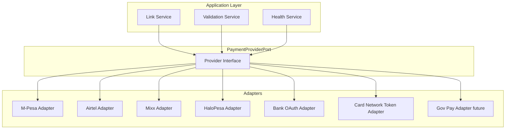
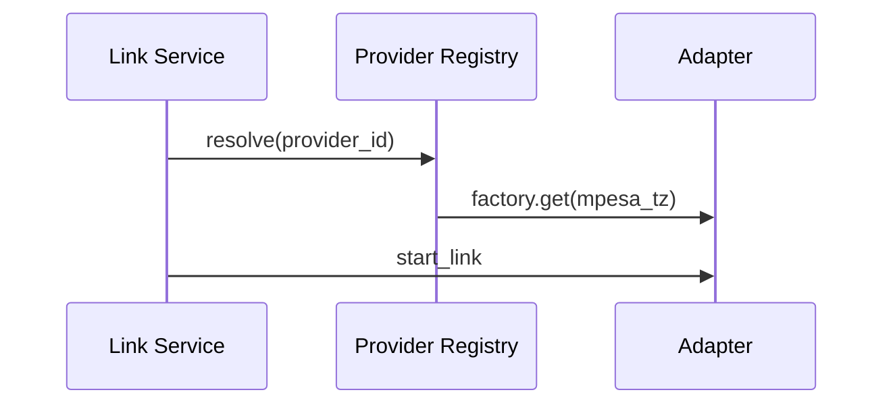

# 02 — Provider Abstraction

**Pattern:** Ports & adapters (hexagonal) — same philosophy as [PAYMENTS.md](../../PAYMENTS.md) `PaymentGateway`, elevated to **link/lifecycle** not charge.

---

## Executive summary

A **Provider Abstraction Layer (PAL)** exposes one internal interface for every PSP. Business logic (linking, listing, consent) never branches on `if mpesa`. New providers ship as adapters only.

---

## Business purpose

Tanzania has many rails; East Africa adds more. Abstraction is the only scalable integration strategy.

---

## Architecture overview

---

## Provider registry

| Provider ID | Type | Link method | Balance check |
| --- | --- | --- | --- |
| `mpesa_tz` | mobile_money | STK Push / OAuth | Limited |
| `airtel_money_tz` | mobile_money | Redirect / API | Limited |
| `mixx_yas_tz` | mobile_money | Partner API | TBD |
| `halopesa_tz` | mobile_money | Partner API | TBD |
| `bank_*` | bank_account | OAuth2 / redirect | Optional |
| `visa_nt` | card | Network tokenization | N/A |
| `mc_nt` | card | Network tokenization | N/A |
| `corp_account` | corporate | Bank file / API | Optional |
| `gov_account` | government | Agency API | TBD |
| `cbdc_future` | cbdc | TBD | TBD |

---

## Standard port methods (Phase 2 — no charge)

| Method | Purpose |
| --- | --- |
| `discover()` | Capabilities, currencies, limits |
| `start_link(context)` | Begin user authorization |
| `complete_link(callback)` | Finish link session |
| `verify_ownership(source_ref)` | Confirm still valid |
| `revoke_link(source_ref)` | PSP-side unlink if supported |
| `map_error(psp_code)` | Normalized errors |
| `health_check()` | Latency + availability |
| `get_version()` | Adapter semver |

**Explicitly excluded until Phase 3:** `authorize`, `capture`, `refund`.

---

## Sequence: adapter selection

---

## Domain model

`Provider`, `ProviderConfiguration`, `ProviderStatus` — [09_DATABASE_MODEL.md](09_DATABASE_MODEL.md).

---

## API specifications

Provider discovery: `GET /api/v1/payment-providers` — [07_API_SPECIFICATION.md](07_API_SPECIFICATION.md).

---

## Domain events

`provider.available`, `provider.unavailable` — [08_EVENT_CATALOG.md](08_EVENT_CATALOG.md).

---

## AWS architecture

Adapters in ECS tasks or sidecar; secrets per provider in Secrets Manager.

---

## Security considerations

Adapter credentials isolated; no cross-provider token reuse.

---

## Implementation strategy

`ProviderAdapter` interface in design package; conformance test suite per adapter.

---

## Future expansion

Plugin marketplace for regional PSPs; dynamic provider enablement via AppConfig.

---

## Cross-references

[06_PROVIDER_ADAPTERS.md](06_PROVIDER_ADAPTERS.md)
